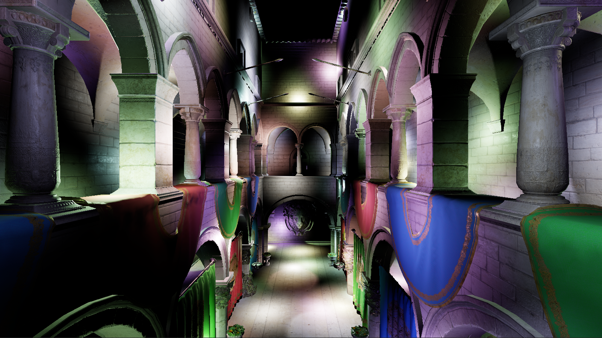
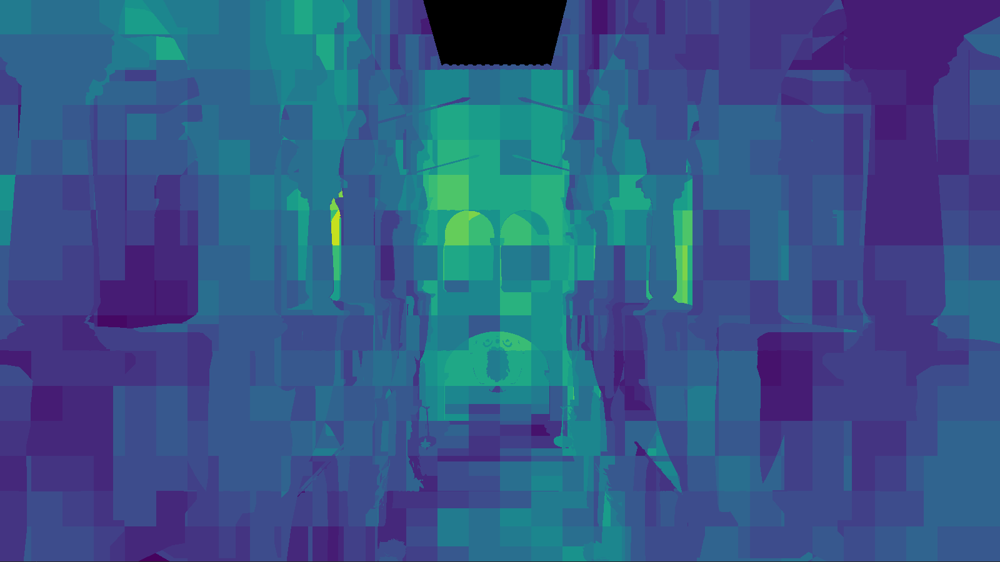
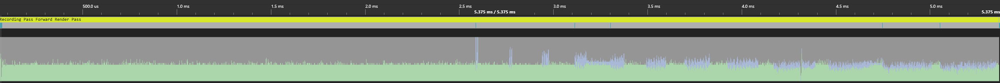
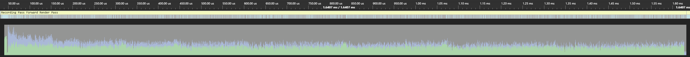
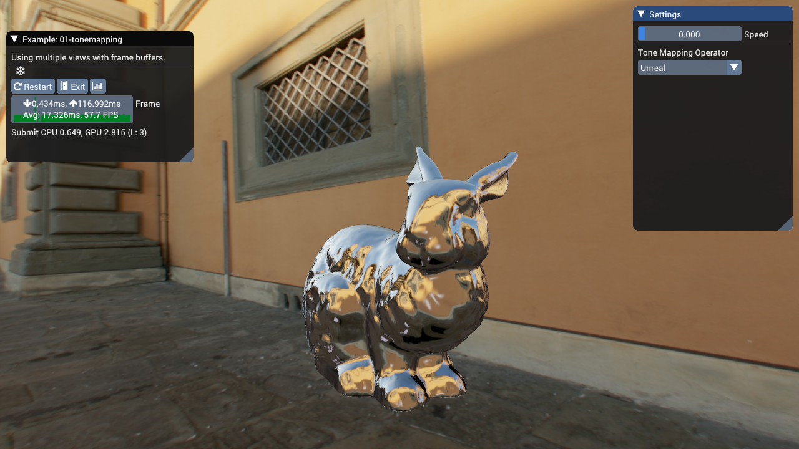
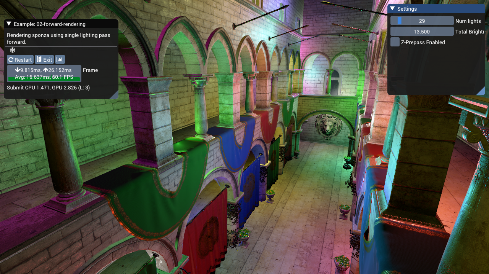
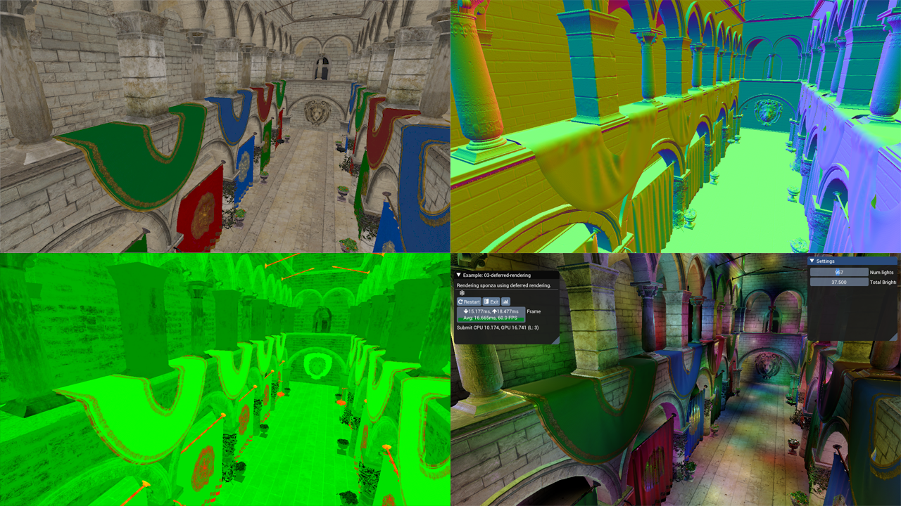
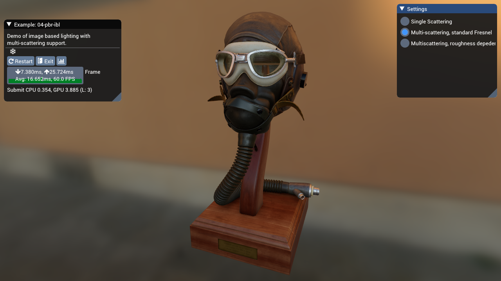

Zec is renderer that wraps the D3D12 API. The primary goal is to provide example implementations of various computer graphics techniques such as clustered shading, PBR shading, etc. and the secondary goal is to do it efficiently using a simple, thin abstraction around D3D12.

Currently, the following implementations have been created, in part as a way of [dogfooding](https://en.wikipedia.org/wiki/Eating_your_own_dog_food) my rendering abstraction:

- Image based lighting with multiple scattering (see description below for [bae](#bae) and [this blog post](https://bruop.github.io/ibl))
- ISPC accelerated view frustum culling, as documented in [another blog post](https://bruop.github.io/improved_frustum_culling/)
- Clustered forward shading using compute shaders

### Clustered Forward Shading

Largely based off [Olsson et al, 2012](http://www.cse.chalmers.se/~uffe/clustered_shading_preprint.pdf), this implementation uses compute shaders to populate a buffer containing per-cluster index lists, which are then used to index into the global light lists.

The current implementation supports binning of both point lights and spot lights using clusters defined as AABBs in view-space. The intersection test used for the spot lights is based of [Bart Wronski's excellent blog post](https://bartwronski.com/2017/04/13/cull-that-cone/), which works well with Olsson's view-space z-partitioning scheme which attempts to maintain clusters that are as cubical as possible.

One difference from Olsson's paper is that I implemented a two-phase partitioning scheme such that the clusters between the near-plane and some user defined "mid-plane" use a linear partitioning scheme, while those beyond the mid-plane use the Olsson partitioning scheme. The Olsson scheme produces very small clusters close to the camera, and using a linear scheme (while providing a worse fit for the bounding sphere tests) provides about a 30% memory reduction while still keeping the clusters small in view space.

One thing to note is that I used 32-byte `uint`s to store light indices, but this is overkill for the number of lights I expect to support. I could easily get away with 16-bits for the index list entries BUT my laptop's 960m lacks the feature support for 16-bit arithmetic 😢

### ISPC Accelerated View Frustum Culling

Most of the details are in two blog posts on this very site ([part 1](https://bruop.github.io/frustum_culling/), and [part 2](https://bruop.github.io/improved_frustum_culling/)), but to summarize, the view culling transforms model-space AABBs to view space and performs a check using the [separating axis theorem](https://en.wikipedia.org/wiki/Hyperplane_separation_theorem) against the view frustum to determine whether the object is in view or not. [ISPC](https://ispc.github.io/) is used to vectorize the system and test 8 AABBs at once.

For 10,000 AABBs, **the system can produce a visibility list in about 0.3ms** using a single core on my i5 6600k.

Here's a graphic of how this reduces wasted vertex work on the GPU as well, as without culling the GPU ends up spending time executing vertex shader work without any corresponding fragment/pixel shader output:

With culling, the wasted work is reduced greatly:

### Render Pass Abstraction

Zec also contains an optional "Render Pass" abstraction (but it's not necessary) that will manage pass resource creation and transitions between passes. For instance, if you have a depth pre-pass that "outputs" a depth buffer and other passes mark as an "input" that will be sampled from pixel or fragment shaders, the render pass system will insert the appropriate resource transition at the beginning of the first pass that consumes the depth buffer "automatically".

Additionally, passes can submit work on the asynchronous compute queue and the abstraction will submit that work separately and even insert cross queue barriers when subsequent passes use the outputs. However, I haven't robustly tested this part of the system yet and I know that it currently breaks when the resources are transitioned using a command list created from the compute queue.

Future plans include:
- Better support for async compute
- Multi-threaded command list recording. Each pass already gets its own command list, but I haven't yet introduced any threading into the library or application.
- Better support for multiple sets of passes. Right now each list of passes is it's own heavyweight structure, making it annoying to support switching between them during runtime. It'd be nicer to have a pool of passes and then lightweight lists that describe recording of commands.

## Bruno's Awful Examples (bae)

Similar to Zec, but this project used BGFX to abstract away OpenGL/DirectX 11. Development ended in late September 2019.

The examples include:

1. Tone Mapping
2. Forward Rendering
3. Deferred Rendering
4. Image Based Lighting
5. Cascaded Shadow Mapping

### Tone Mapping

While the BGFX repo already contains an example of HDR tone-mapping, it is implemented using a chain of down-sampled textures and operators like the Uncharted and Reinhard curves. I was interested in implementing a more modern approach, so my implementation has a few differences.

It uses a compute shader to construct a luminance histogram of the input HDR framebuffer, and another that performs a weighted average using the histogram to obtain an average luminance.

The average luminance is then used to create an exposure value which we can then use to scale our input luminance, which we then feed into different tone map operators. The example includes a few different operators:

- [Reinhard](http://www.cs.utah.edu/~reinhard/cdrom/tonemap.pdf) with variable white point
- Unreal, based off ACES with built in gamma correction
- [Lottes](http://32ipi028l5q82yhj72224m8j.wpengine.netdna-cdn.com/wp-content/uploads/2016/03/GdcVdrLottes.pdf)
- [Uchimura](https://www.desmos.com/calculator/gslcdxvipg)

For more detail and comparisons, please see the two blog posts I've written documenting the process:

- [Automatic Exposure Using a Luminance Histogram](https://bruop.github.io/exposure/)
- [Tone Mapping](https://bruop.github.io/tonemapping/)

### Forward vs. Deferred Rendering

The two examples `02-forward-rendering` and `03-deferred-rendering` are set up to be largely identical, but with a few key differences to highlight the strengths and weaknesses of forward vs deferred rendering.

Both examples render a version of the [Sponza scene](https://github.com/KhronosGroup/glTF-Sample-Models/tree/master/2.0/Sponza) that includes textures for the "metallic-roughness" workflow. We use a fairly standard single-scattering BRDF:

- Trowbridge-Reitz (GGX) normal distribution
- Smith correlated visibility term
- Schlick Fresnel Approximation

With some additional GLTF features supported:

- Occlusion texture
- Emissive texture
- Base color, emissive, metallic and roughness factors

#### Forward Rendering

The forward renderer supports up to 255 point lights in the scene, but there is no culling of the lights evaluated per draw call, so slow down happens quickly (after about 50 lights on my machine). The light data is passed using uniform arrays and evaluated through a simple for loop. We only evaluate the BRDF if the light's incident value is zero, which we can do since we use the non-physical fall-off function from [Karis 2014](https://cdn2.unrealengine.com/Resources/files/2013SiggraphPresentationsNotes-26915738.pdf). Therefore the intensity of the lights will also have an impact on performance. At lower total intensity settings (around 10.0) my computer can handle ~150 lights in the scene before it starts dropping frames regularly.

There's also a z-prepass to reduce the amount of overdraw, which has a pretty drastic effect on performance as we don't have any sorting of our draw calls based off depth (by default, BGFX sorts draw calls to minimize state changes).

#### Deferred Rendering

Meanwhile, in the deferred case we use **light volumes** to calculate our shaded pixel values. We render each point light using two draw calls: one which only writes the stencil buffer, marking any pixels that we don't want to shade, and then a second draw with the same geometry that tests against those stencil values and perform the shading, writing to the output buffer additively.

The first draw draws both back and front faces and will mark pixels using the following test:

- For front facing geometry, if it fails the depth test, those pixels are occluded by scene geometry that is in front of the volume.
- For back facing geometry, if it passes the depth test, those pixels are beyond the light's volume.

In both cases we increment the stencil buffer, and use a stencil test against `0` (the starting value) for the second draw call.

With this scheme, we submit 2N draw calls for N lights, but we strictly shade only pixels that fall within the light volume so we end up with significant gains in terms of the number of lights we can have in a scene. If the light volumes overlap for many pixels and many number of lights, we'll still end up with poor performance however, as our solution basically regresses to the forward rendered solution but with extra draw calls.

With a lower total intensity (again, 10.0) my computer can evaluate about ~1000 lights before slowdown occurs. Above that, the CPU time required to perform all the state changes and submit the draw calls for all our lights starts to outpace our GPU's ability to render frames.

Additionally, the deferred example has no support for transparency. In our Sponza scene all the vegetation is rendered using an alpha cutoff, which we can still render to our G-Buffers. There is also no support for hardward MSAA, so AA would have to be implemented using a custom solution.

Finally, the emissive lighting was applied using a full-screen quad, similar to what you'd need to do for directional lights (in fact you could probably do both in the same pass).

### Physically Based Image Based Lighting

Since I had a GLTF model loader, I figured it would be nice to be able to render them using image based lighting. BGFX already has an example for IBL, but it relies on external software to generate the pre-filtered environment maps, which was actually exactly the part I wanted to understand better. So I decided to implement IBL "from scratch" using [Karis 2014](https://cdn2.unrealengine.com/Resources/files/2013SiggraphPresentationsNotes-26915738.pdf) as a guide, and then augmenting the BRDF with recent work on multi-scattering BRDFs. So this example includes compute shaders for generating the BRDF LUT, pre-filtered environment map and irradiance map.

I wrote an extensive overview of the implemention in [a blog post](https://bruop.github.io/ibl/), so if you're interested in more detail please check that out! It was a really fun project.

### Cascaded Shadow Maps

Having never worked with shadow maps I figured it'd be a good idea to try and implement one of the more complicated shadow mapping algorithms, cascaded shadow mapping.

The idea is simple: render many different shadow maps that cover different parts of your view frustum to maximize the shadow map density closer to the camera, allowing for fewer "perspective aliasing" artifacts. However, the exact placement of the cascades can be simple, manual or it can be more involved.

In this example, the cascades are placed by using a logarithmic placement algorithm (eq 7.5 in [RTR Vol 4](http://www.realtimerendering.com/)) and bounded using a depth reduction step (performed on the GPU using compute shaders). The min and max depth values are stored inside a 1x1 texture and read back on the CPU, which uses the data to determine each cascade's view frustum.

The view frustum is further constrained using the scene axis-aligned bounding box, to ensure that the near and far planes are beyond the scene geometry and that the left, right, top and bottom planes do not exceed the bound of the scene.

This maximizes our effective shadow map resolution, but it does come with some drawbacks. For one, there's no way for us to really "clamp" the movement of our cascades to texel sized increments as the world space size of our texel is constantly changing, so we still experience the pixel crawl of unstabilized cascades.

I've also added percentage close filtering (PCF) using a randomly oriented poisson disk, as explained in [this presentation by Kaysan](https://www.realtimeshadows.com/sites/default/files/Playing%20with%20Real-Time%20Shadows_0.pdf). My implementation is a bit simpler however, and I just perform the 16 taps with the same size in light space for all pixels which don't self occlude.
