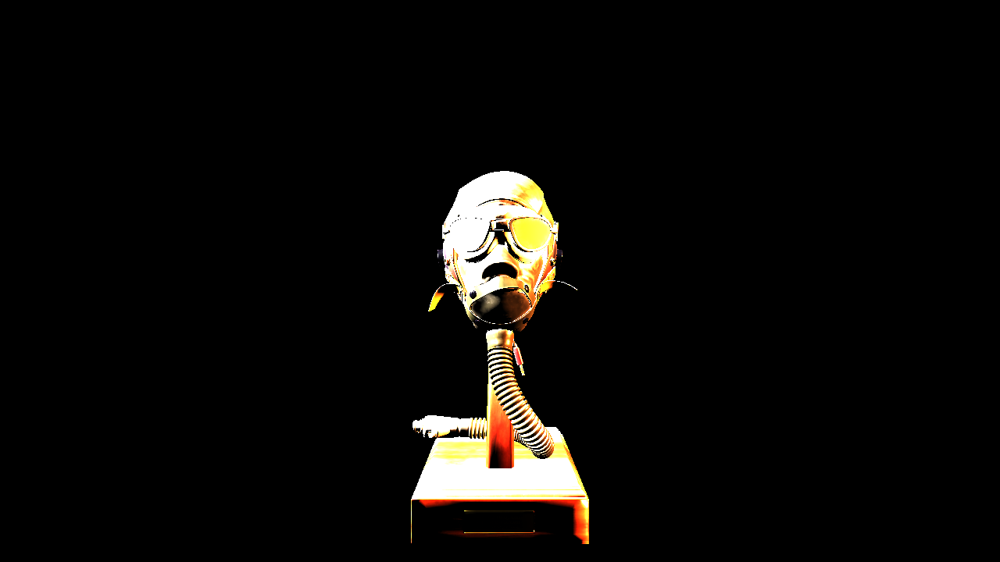

_This is part one of two on tone mapping. The other part can be found [here](/tonemapping)_

## Introduction

Recently, I've been building a small renderer using the cross-platform rendering library [bgfx](https://github.com/bkaradzic/bgfx) as a learning exercise. It loads [glTF](https://github.com/KhronosGroup/glTF-Sample-Models) models, shading them using the Cook-Torrance model described in the [glTF specification](https://github.com/KhronosGroup/glTF/blob/master/specification/2.0/README.md). The implementation is incomplete and it renders the material using only punctual lights. It's a single vertex + fragment shader. I loaded up the `FlightHelmet` model, added two lights on each side, started up my program and saw this:



You can see that the lit areas are basically just the color of the light sources, with ugly, uniform splotches removing all of the detail we'd expect to get from the normal maps and albedo textures. This is not unexpected. It may not be obvious why this isn't a bug and why we'd expect our fragment shader to produce such an ugly image, so let me quickly explain.

What we want in the end is this:


### Physically Based Lighting

In physically based rendering, objects are rendered using _physically based units_ from the fields of [Radiometry](https://en.wikipedia.org/wiki/Radiometry) and [Photometry](<https://en.wikipedia.org/wiki/Photometry_(optics)>). The [rendering equation](https://en.wikipedia.org/wiki/Rendering_equation) is meant to produce the [radiance](https://en.wikipedia.org/wiki/Radiance) for each pixel. In my example, the lights are using the photometric unit of [lumens](<https://en.wikipedia.org/wiki/Lumen_(unit)>), and both are set to emit 800 lm, but it could be much higher. The sun, a directional light, illuminates the earth's surface with ~120,000 [lux](https://en.wikipedia.org/wiki/Lux). This means that when we solve the rendering equation for these objects, we're going to end up with values that are effectively unbounded and we may end up with radiance values that differ by several orders of magnitude in the same frame. Additionally, all of our calculations are taking place in linear space -- that is to say, that an RGB value corresponding to (1.0, 1.0, 1.0) corresponds to half as much radiance as a value of (2.0, 2.0, 2.0).

This is a problem however, because (most) of our displays work differently. Standard definition displays expects our frame buffer to contain RGB values in the [sRGB color space](https://en.wikipedia.org/wiki/SRGB) that are between 0 and 1, with (1.0, 1.0, 1.0) corresponding to white.<sup>[1](#note_1)</sup> So any RGB that our fragment shader produces are clamped to [0, 1] when they are written to the 32-bit back buffer. So we end up with clipped colors, and everything ends up being basically white!

## Tone Mapping

The solution then, is to take our physical, unbounded HDR values and map them first to a LDR linear space [0, 1], and then finally apply [gamma correction](http://blog.johnnovak.net/2016/09/21/what-every-coder-should-know-about-gamma/) to produce the sRGB value our displays expect. Here's a diagram that describes the most basic tone mapping pipeline:


The pipeline has 5 stages:

1. Render your scene into a framebuffer that supports HDR values i.e. a floating point buffer with 16-bits or 32-bits per channel. Which one you choose is (as always) a tradeoff between precision, range and memory, but for my scene I'm going to go with a RGBA16F framebuffer. Make sure your output is in linear space.
2. Using either mip mapping or compute shaders, find the average scene luminance using the HDR color buffer.
3. In a separate render pass, produce a linear, clamped color buffer by:
   1. Scaling the input using the average scene luminance to obtain a "calibrated" RGB value
   2. Scaling the calibrated value using a Tone Curve, inputting either the RGB or the luminance value of the fragment
4. Transform your linear clamped value using the inverse electrical optical transfer function (EOTF).
   - With typical, non-HDR displays, we're basically transforming our linear color into sRGB color space by applying the inverse gamma transformation
5. Write this non-linear result to the back buffer, which is presented to the user.

In the figure, the green arrows indicate that the inputs/outputs are in linear space, while the orange arrow is in gamma space.

In the rest of this post, I'm going to tackle the second step of finding the average luminance value, and how we can use it to scale the input luminance. The third step is tackled in [the next post which is specifically on tone operators](/tonemapping).

So first, let's explain the process of scaling the input luminance using Exposure.

### Exposure

When a human eye views a scene, it will naturally dilate to adjust to the amount of light reaching it. Similarly, photographers have several ways to control the amount of light reaching the sensors, such as the aperture size (f-stop) and shutter speed. In photography, these controls correspond to the [exposure value](https://en.wikipedia.org/wiki/Exposure_value), or $EV$, which is a logarithmic representation of the luminance. Increasing the $EV$ by a value of +1 results in a doubling of the luminance.

In our context, the exposure linearly scales our the scene luminance to simulate how much light is actually hitting the sensor. The reason we do this is to bring our input scene into the domain where our tone operators will scale the final values the way we expect. It took me a while to understand how this works compared to a camera, but it's actually basically the same idea. With a physical camera, the amount of photons hitting the sensors needs to be controlled such that we are able to resolve features, avoiding having too much or too little light.

It's up to us to actually provide the exposure value, but in order to avoid having it set by the user/artist, we're going to use the average scene luminance to derived from our HDR buffer to calculate the exposure.

There are actually quite a few different ways to calculate exposure from average scene luminance, many of which are explained in this excellent post by [Krzysztof Narkowicz](https://knarkowicz.wordpress.com/2016/01/09/automatic-exposure/). For this post, I'm going to use the method described in [Lagard and de Rousiers, 2014](https://media.contentapi.ea.com/content/dam/eacom/frostbite/files/course-notes-moving-frostbite-to-pbr-v2.pdf) (pg. 85). Basically, we can calculate the luminance value that will saturate the sensor, $L_{\text{max}}$, then use that to scale our scene luminance:

$$
EV_{100} = \log_{2} \left(L_{\text{avg}} \frac{S}{K} \right)
$$

$$
L_{\text{max}} = \frac{78}{qS} \times 2^{EV_{100}} \\
$$

$$
\text{H} = \frac{1}{L_{\text{max}}} \\
$$

Where $S$ is the Sensor sensitivity, $K$ is the reflected-light meter calibration constant, $q$ is the lens and vignetting attentuation, $H$ is the exposure and $L_{\text{avg}}$ is the average scene luminance.

If we were fully modelling a physical camera, we might need to use different $S$ values to offset the loss of light when changing the aperture size, which also effects the depth of field. But since we aren't worrying about that, we'll use $S=100$. Meanwhile, it seems that Canon, Nikon and Sekonic all use $K = 12.5$ and it seems most rendering engines follow suit. Finally, $q=0.65$ appears similarly ubiquitous. If you want to know a bit more about what these quantities actually represent, the previously referenced [Lagard and de Rousiers, 2014](https://media.contentapi.ea.com/content/dam/eacom/frostbite/files/course-notes-moving-frostbite-to-pbr-v2.pdf) has more detail, as does the [Filament](https://google.github.io/filament/Filament.html#physicallybasedcamera) documentation.

Simplifying our equations a bit and plugging in the numbers, We can now rewrite our previous equation for $L_{\text{max}}$ more simply:

$$
L_{\text{max}} = 9.6 \times L_{\text{avg}}
$$

Our final scaled color is then simply:

$$
c_{rgb}^\prime = \text{H} \times c_{rgb} = \frac{c_{rgb}}{L_{\text{max}}} = \frac{c_{rgb}}{9.6 \times L_{\text{avg}}}
$$

Note that this value is still not clamped to [0, 1], and so we will still potentially get a lot of clipping.

Additionally, we haven't discussed how to actually calculated the average luminance. There are two popular ways to do so:

- Use a geometric average, obtained by repeatedly downsampling the luminance of our HDR image (similar to a mip map chain).
- Create a histogram of some static luminance range.

The geometric average is susceptible to extreme values being over-represented in the final luminance value, so instead we're going to construct the histogram. This allows us more control (if we desire it) over how extreme values influence our "average" -- with a histogram, we can choose to use other features, like the median, if we wanted to. For now, we'll stick with the average.

### Constructing the Luminance Histogram

To construct the histogram, I used [Alex Tardif's](http://www.alextardif.com/HistogramLuminance.html) blog post on the exact same subject as a reference. I'll still explain the code here, and try to focus on the parts that confused me the most while trying to replicate Tardif's method. Here's the compute shader, written using BGFX's version of glsl:

```glsl
// This defines all the preprocessor definitions that translate things
// like gl_LocalInvocationIndex to HLSL's SV_GroupIndex
#include <bgfx_compute.sh>

#define GROUP_SIZE 256
#define THREADS_X 16
#define THREADS_Y 16

#define EPSILON 0.005
// Taken from RTR vol 4 pg. 278
#define RGB_TO_LUM vec3(0.2125, 0.7154, 0.0721)

// Uniforms:
uniform vec4 u_params;
// u_params.x = minimum log_2 luminance
// u_params.y = inverse of the log_2 luminance range

// Our two inputs, the read-only HDR color image, and the histogramBuffer
IMAGE2D_RO(s_texColor, rgba16f, 0);
BUFFER_RW(histogram, uint, 1);

// Shared histogram buffer used for storing intermediate sums for each work group
SHARED uint histogramShared[GROUP_SIZE];


// For a given color and luminance range, return the histogram bin index
uint colorToBin(vec3 hdrColor, float minLogLum, float inverseLogLumRange) {
  // Convert our RGB value to Luminance, see note for RGB_TO_LUM macro above
  float lum = dot(hdrColor, RGB_TO_LUM);

  // Avoid taking the log of zero
  if (lum < EPSILON) {
    return 0;
  }

  // Calculate the log_2 luminance and express it as a value in [0.0, 1.0]
  // where 0.0 represents the minimum luminance, and 1.0 represents the max.
  float logLum = clamp((log2(lum) - minLogLum) * inverseLogLumRange, 0.0, 1.0);

  // Map [0, 1] to [1, 255]. The zeroth bin is handled by the epsilon check above.
  return uint(logLum * 254.0 + 1.0);
}

// 16 * 16 * 1 threads per group
NUM_THREADS(THREADS_X, THREADS_Y, 1)
void main() {
  // Initialize the bin for this thread to 0
  histogramShared[gl_LocalInvocationIndex] = 0;
  groupMemoryBarrier();

  uvec2 dim = imageSize(s_texColor).xy;
  // Ignore threads that map to areas beyond the bounds of our HDR image
  if (gl_GlobalInvocationID.x < dim.x && gl_GlobalInvocationID.y < dim.y) {
    vec3 hdrColor = imageLoad(s_texColor, ivec2(gl_GlobalInvocationID.xy)).xyz;
    uint binIndex = colorToBin(hdrColor, u_params.x, u_params.y);
    // We use an atomic add to ensure we don't write to the same bin in our
    // histogram from two different threads at the same time.
    atomicAdd(histogramShared[binIndex], 1);
  }

  // Wait for all threads in the work group to reach this point before adding our
  // local histogram to the global one
  groupMemoryBarrier();

  // Technically there's no chance that two threads write to the same bin here,
  // but different work groups might! So we still need the atomic add.
  atomicAdd(histogram[gl_LocalInvocationIndex], histogramShared[gl_LocalInvocationIndex]);
}
```

This compute shader creates work groups of 256 threads (`NUM_THREADS`) that operate on 16 * 16 pixel chunks of our HDR input image. Each thread then operates on one pixel, assigning it a bin index for our histogram using its luminance value (`colorToBin`), increasing the count in the bin by one. The `NUM_THREADS` are chosen such that the `gl_LocalInvocationIndex` maps from 0 - 255 (since `16*16\*1 == 255`), which is convenient for reasoning about how we access our histogram buffer, which has 256 bins. The figure below may help you visualize how the global work groups and individual invocations work to process the image:


Each work group has a shared buffer, `histogramShared`, to store the counts only for the chunk of pixels it is operating over, but then the local results are added into our global `histogram` buffer at the end of the invocation. This allows us to avoid locking the global buffer for every pixel we operate on.

It's also important to note that we use the shared buffer `histogramShared` to store the intermediate results for each work group, and then aggregate the results into the global `histogram` buffer only at the end of each invocation.

After dispatching the compute shader with a work group size large enough to cover the entire image, the input buffer will now be filled with the histogram data.

### Calculating the Average

With the luminance buffer now in hand, we can our average. Since the buffer purely exists on the GPU, we can use another compute shader to find the average. This time, we're not mapping our compute space to a 2D image, but to our 1D histogram buffer instead. Additionally, instead of writing to the buffer, we'll be reading from the buffer and storing our value into a single-pixel R16F texture. So things will be a bit simpler than in the last program. Once again following [Alex Tardif's lead](http://www.alextardif.com/HistogramLuminance.html), the compute shader is show below.

```glsl
#include "bgfx_compute.sh"

#define GROUP_SIZE 256
#define THREADS_X 256
#define THREADS_Y 1

// Uniforms:
uniform vec4 u_params;
#define minLogLum u_params.x
#define logLumRange u_params.y
#define timeCoeff u_params.z
#define numPixels u_params.w

#define localIndex gl_LocalInvocationIndex

// We'll be writing our average to s_target
IMAGE2D_RW(s_target, r16f, 0);
BUFFER_RW(histogram, uint, 1);

// Shared
SHARED uint histogramShared[GROUP_SIZE];

NUM_THREADS(THREADS_X, THREADS_Y, 1)
void main() {
  // Get the count from the histogram buffer
  uint countForThisBin = histogram[localIndex];
  histogramShared[localIndex] = countForThisBin * localIndex;

  groupMemoryBarrier();

  // Reset the count stored in the buffer in anticipation of the next pass
  histogram[localIndex] = 0;

  // This loop will perform a weighted count of the luminance range
  UNROLL
  for (uint cutoff = (GROUP_SIZE >> 1); cutoff > 0; cutoff >>= 1) {
    if (uint(localIndex) < cutoff) {
      histogramShared[localIndex] += histogramShared[localIndex + cutoff];
    }

    groupMemoryBarrier();
  }

  // We only need to calculate this once, so only a single thread is needed.
  if (threadIndex == 0) {
    // Here we take our weighted sum and divide it by the number of pixels
    // that had luminance greater than zero (since the index == 0, we can
    // use countForThisBin to find the number of black pixels)
    float weightedLogAverage = (histogramShared[0] / max(numPixels - float(countForThisBin), 1.0)) - 1.0;

    // Map from our histogram space to actual luminance
    float weightedAvgLum = exp2(((weightedLogAverage / 254.0) * logLumRange) + minLogLum);

    // The new stored value will be interpolated using the last frames value
    // to prevent sudden shifts in the exposure.
    float lumLastFrame = imageLoad(s_target, ivec2(0, 0)).x;
    float adaptedLum = lumLastFrame + (weightedAvgLum - lumLastFrame) * timeCoeff;
    imageStore(s_target, ivec2(0, 0), vec4(adaptedLum, 0.0, 0.0, 0.0));
  }
}
```

For each thread, we read in the histogram value and store it in a local variable. Then we use a shared buffer to store a weighted count. We also take this opportunity to reset the global histogram buffer so that it can be used in the next frame. Take note that we've aliased

the biggest trick here is the loop that accumulates the count into a single element of our shared buffer. It's a way of leveraging the parallel nature of our compute space to perform the sums over two cells at a time, with the separation between the two cells starting at `cutoff = NUM_THREADS / 2`, then being halved every iteration, until we end up with a distance of 0. The threads that have `gl_LocalInvocationIndex > cutoff` will be stalled, as they cannot contribute to the sum. The figure below illustrates the first few iterations for the thread with index `i`:


In the diagram, the red regions of the buffer are summed with the blue regions and stored in the blue. In the next interation, the red regions become gray, indication that they are ignored for this (and all following) iterations. It's important to note that since the buffer sizes and the compute size is the same, we are actually stalling the threads corresponding to the red and gray regions with `if (uint(gl_LocalInvocationIndex) < cutoff)` that can be seen in the code above. Only the blue regions are active. This may seem wasteful, but we'll still get an aggregation in `O(log_2(N))` iterations instead of `O(N)`, so the speed up is considerable over the naive, single threaded approach.

At the end of the loop, we now have our weighted sum, which we can easily use to find our final "average" value. To do so, we first divide our weighted count (stored in by the aggregation above `histogramShared[0]`) and divide it by the number of pixels that contribute _any_ luminance -- we exclude the count that was stored in `histogram[0]` since those were the ones that fell below our threshold luminance value.

Finally, we move from the histogram bin space back to actual luminance values by performing the inverse of the operation we performed when constructing the histogram. This gives us the actual average luminance value for this frame.

However, to prevent sudden changes in the exposure which would cause the final image to "flicker" for the user, we are going to use the [last frame's exposure value](https://google.github.io/filament/Filament.html#mjx-eqn-adaptation) to smoothly change the value we store in the image. That's it! We now have our $L_{avg}$ value, which we can use with the equation above to calculate the exposure to prepare our image for tone mapping! Which is in the next blog post.

## Code Sample

The images of the bunny were created using a BGFX-style example that you can find [here](https://github.com/BruOp/bgfx/tree/tonemapping/examples/41-tonemapping). It includes the set up of the scene and GPU resources as well as the shaders that we've already gone over.

## Notes

1. This is not true for HDR displays. Those displays use other color spaces that [newer games are starting to support](https://www.ea.com/frostbite/news/high-dynamic-range-color-grading-and-display-in-frostbite).

## References

While I've tried to diligently link to my references, I also have a general collection of links on tone mapping [here](https://github.com/BruOp/3d_programming_references#tone-mapping).

<!-- I've read about many different techniques in computer graphics on blogs, twitter and my copy of [Real Time Rendering](), but I've rarely actually gone through and implemented any of them. My previous attempts to start had be -->
