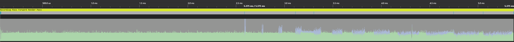

- [Introduction](#introduction)
- [Culling and Bounding Volumes](#culling-and-bounding-volumes)
- [OBB Culling](#obb-culling)
- [Further Optimization](#further-optimization)
- [SIMD Implementation](#simd-implementation)
- [Conclusion](#conclusion)

## Introduction

It's been a while since I wrote anything for this blog, as the last year and a half has been a bit of a rollercoaster! At some point I decided to try and write my own DX12 rendering lib from scratch, and it was probably a huge waste of time from a "implementing graphics techniques" perspective, but it's definitely forced me to read and write a lot more C/C++ code. I've definitely learned how to _not_ try to abstract certain things. But that's not what this blog post is about! Instead, it's about implementing a simple version of frustum culling on the CPU.

Before we talk about that though, let's first consider what happens when you submit a draw call for a mesh that's not visible from the camera's point of view. First, we'll have to record the associated information into a command buffer -- pointers to the meshes we're rendering, any changes in pipeline state, texture pointers and material data, etc. Recording and submitting this data is relatively cheap using DX12, but not free. The command buffer is then copied and sent over to the GPU through your PCIe bus, at which point the GPU command processor can start consuming it.

The first stage in the Pipeline is going to be Input Assembly, or IA, where we load indices from the mesh's index buffer (if applicable) as well as the vertex data associated with those indices, which are then passed to our Vertex Shaders. This second stage is primarily responsible for transforming our vertices into normalized device coordinate (NDC) space, usually determined using the model, view and projection transforms we've passed in from the CPU side of our application. With that work done, the next stage is Primitive Assembly which will group our vertices into the primitive type set by our pipeline state (e.g. points, lines or triangles) and perform viewport and backface culling as well as clipping of any primitives that intersect the boundaries of NDC space.

For a visible mesh, there are further stages but this is the end of the line for our non-visible meshes since they will be completely culled by the viewport culling, resulting in an early exit. If you're interested in a more exhaustive overview of the pipeline, I recommend this [series of blog posts by Fabian Giesen](https://fgiesen.wordpress.com/2011/07/09/a-trip-through-the-graphics-pipeline-2011-index/). The point is, that all this work I just described is completely wasted! None of that work results in changes to the final image that appears on screen.

Additionally, we should also consider that we often render the same scene from multiple points of view, for example when rendering shadow maps we will need to submit all these commands again!

So obviously we're performing a ton of extra work that is totally useless. To demonstrate this, I setup a scene with 10,000 [Boom Boxes](https://github.com/KhronosGroup/glTF-Sample-Models/tree/master/2.0/BoomBox) arranged in a 3D grid around the origin. The data associated with their draw calls is stored in linear arrays that we loop through during our render pass, so it's basically as simple as I could make it. The camera sits in the middle of this 3D grid. Here's an overhead view with only a small horizontal slice of those boom boxes:


All the meshes being rendered behind the blue line that represents our view frustum represent wasted work! Naively rendering all 10,000 of those meshes on my PC resulted in the following timings:

Task               | Timing (ms)
-------------------|-------------
CPU Command Buffer Creation + Submission  | 2.4
GPU execution             | 5.8
**Total**                 | **8.2**

Below is the output of the occupancy graph:



This graph displays a timeline of how our GPU was utilized during the frame, specifically indicating the number of waves/warps being run in parallel per SM. The green indicates that the warps are being used for vertex shading, while the light blue indicates that they're being used for pixel/fragment shading. We can see here that of the ~5.6 ms required to render all our meshes, we spent the majority of that time running the vertex shaders for geometry that has no corresponding vertex shading and was completely culled from our final image.

Let's take a look at how we can spend less time doing useless work. The solution seems obvious: don't try to render objects out of view! That should mean fewer commands, which should mean less wasted time on both the CPU and GPU.

## Culling and Bounding Volumes

Frustum culling is the process of identifying which rendering primitives are actually relevant to your current view by performing intersection checks against your view frustum. The diagram below shows an example of this, with objects lying outside the view frustum being outlined with a dotted stroke (and labelled with "view frustum").


There are actually quite a few different ways to solve this problem and as always they come with various benefits and drawbacks. The first choice you'll have to make is how you want to represent the bounds of your meshes, as testing the raw geometry against your frustum won't be feasible, you'd just be re-implementing vertex shading on the CPU! Therefore we need a simplified geometry instead, the two most common choices being bounding spheres or oriented bounding boxes (OBBs). Usually Axis Aligned Bounding Boxes (AABBs) are used to calculate the OBBs. Below is an example of an AABB, bounding sphere and OBB for our boom box.


The simplicity of a sphere provides a few beneficial properties, namely intersection tests against other primitives are simple and cheap. Spheres also have an extremely compact data representation, requiring only a position and radius. On the other hand, the most notable drawback to using bounding spheres for culling is that the quality of spheres as bounding volumes drops quickly as the objects they enclose become "longer". If an object's bounds extends much further along one axis than it does in others, then the volume will contain mostly empty space.

Boxes are an alternative that are much better suited to objects that do not have roughly equal maximal extents, since they store the distance from the center along each axis. An Axis aligned bounding box (AABB) is the simplest version, where the edges of the box are aligned with our coordinate axes. Oriented bounding boxes are a bit more complicated in that they can have arbitrary orientation. AABBs are commonly used to represent the bounding volume in model space, while OBBs are used to represent the bounds after the object is transformed to World or View space. OBBs have almost the opposite trade-offs to spheres. For instance, their representation requires storing either all 8 vertices or the three vectors that run alongside the edges of the box. Intersection tests are more expensive. However, as mentioned, they can be a much "tighter" fit for arbitrary geometry.

Which volume you use in the end depends on how accurate vs fast you need your frustum culling to be. Some games will break culling down into broad and fine phases, so that the first broad phase can use spheres and the fine phase uses other geometry (or other culling techniques altogether). I ended up choosing OBBs because as demonstrated below, we can actually choose a very simple intersection test for the specific task of view frustum culling.

<!--
I should also bring up that sometimes people compute a bounding volume hierarchy (BVH) for their scene to allow for faster culling -- if you know the bounding volume of half of your scene is out of frame, then you do not need to test the bounding volumes within. I didn't really look into this because I found my exhaustive search to be fast enough, and introducing hierarchical data structures can also cause things to be slower! Frostbite provides a good example of this in their presentation on culling. -->

## OBB Culling

While OBB intersection tests against arbitrary planes are more complicated than when using spheres, there is one exception. For points in __clip space__, whether they are in the view frustum can be determined using a trivial test:

$$
\begin{aligned}
-w &\leq x \leq w \\
-w &\leq y \leq w \\
0 &\leq z \leq w \\
\end{aligned}
$$

As a quick reminder, points can be transformed from model to clip space using a Model-View-Projection (MVP) matrix. This means we'll need to transform all of the vertices of our AABBs into clip space.

In my implementation, the output of the culling is a list of ids for the objects I want to render. The input is the camera, and then for each object a model-to-world transform plus a model space AABB. The culling function looks like:

```c++
struct Camera {
  mat4 view;
  mat4 projection;
  // Some other stuff!
}

struct AABB {
  vec3 min = {};
  vec3 max = {};
}

void cull_AABBs_against_frustum(
    const Camera& camera,
    const Array<mat4>& transforms,
    const Array<AABB>& aabb_list,
    Array<u32>& out_visible_list
) {
    mat4 VP = camera.projection * camera.view;
    for (size_t i = 0; i < aabb_list.size; i++) {
        // model->view->projection transform
        mat4 MVP = VP * transforms[i];

        const AABB& aabb = aabb_list[i];
        if (test_AABB_against_frustum(MVP, aabb)) {
            out_visible_list.push_back(i);
        }
    }
}
```

The visibility test is simple: we use our AABB corners (`min` and `max`) to initialize eight vertices. Then transform each vertex to clip space, then perform our test as defined above:

```c++
bool test_AABB_against_frustum(mat4& MVP, const AABB& aabb)
{
    // Use our min max to define eight corners
    vec4 corners[8] = {
        {aabb.min.x, aabb.min.y, aabb.min.z, 1.0}, // x y z
        {aabb.max.x, aabb.min.y, aabb.min.z, 1.0}, // X y z
        {aabb.min.x, aabb.max.y, aabb.min.z, 1.0}, // x Y z
        {aabb.max.x, aabb.max.y, aabb.min.z, 1.0}, // X Y z

        {aabb.min.x, aabb.min.y, aabb.max.z, 1.0}, // x y Z
        {aabb.max.x, aabb.min.y, aabb.max.z, 1.0}, // X y Z
        {aabb.min.x, aabb.max.y, aabb.max.z, 1.0}, // x Y Z
        {aabb.max.x, aabb.max.y, aabb.max.z, 1.0}, // X Y Z
    };

    bool inside = false;

    for (size_t corner_idx = 0; corner_idx < ARRAY_SIZE(corners); corner_idx++) {
        // Transform vertex
        corners[corner_idx] = MVP * corners[corner_idx];
        // Check vertex against clip space bounds
        inside = inside ||
            within(-corner.w, corner.x, corner.w) &&
            within(-corner.w, corner.y, corner.w) &&
            within(0.0f, corner.z, corner.w);
    }
    return inside;
}
```

With this, we now have a working version of frustum culling! Re-running the same test from earlier, let's examine the differences in performance, with rough timings in the table below:

Task               | Timing (ms)
-------------------|-------------
Frustum Culling    | 1.2
CPU Command Buffer Creation + Submission  | 1.5
GPU execution             | 1.5
**Total**                 | **4.2**

We can see that while we've added an extra step, but we've save some time while recording and submitting our command buffer. Our CPU frame time has gone up a little as a result. However, the GPU execution has decreased by about 4.3 ms! That's an almost 75% decrease in frametime. Additionally, if we look at GPU timeline and occupancy, we see huge gains, with the render time reduced to 2.455 ms. Below is the occupancy graph, notice how much less unused vertex shader work there is.


## Further Optimization

We've already improved our timing by about 33%, but we're now spending a significant percentage of our frame time culling these objects. At this point, we could attempt several different optimizations (all of which could be potentially combined):

- Introducing acceleration structures that let us entire groupings of objects at once (as mentioned previously, bounding volume hierarchies are commonly used). In theory, culling time no longer increases linearly as a function of number of AABBs.
- Spreading our culling across many different threads/cores, having each core process a subset of objects at the same time.
- "Vectorize" our code, taking advantage of data level parallelism and SIMD.

Each option comes with it's own set of tradeoffs, which is basically always the case. Building acceleration structures is not free and will add it's own line item to our per-frame timing summary. To reduce the cost, the scene is often split into static and non-static hierarchies, with the static BVH only being built once outside the frame loop, but the non-static BVH will still require updating per frame. Additionally, care must be taken when building tree data structures that we don't end up making the culling process slower due to CPU cache misses when traversing down the tree. If your scene is mostly static, then it might make sense to build a BVH for static objects, flatten it to minimize cache misses, and then simply linearly loop through your dynamic objects as we've done here. [Frostbite](https://www.gdcvault.com/play/1014491/Culling-the-Battlefield-Data-Oriented) actually presented a case where removing their BVH and replacing it with a naive linear array resulted in a 3x improvement in speed.

Meanwhile, introducing multi-threading is not trivial and can easily make the entire thing slower. I actually played around with using [FiberTaskingLib](https://github.com/RichieSams/FiberTaskingLib) to launch tasks that culled 1024 objects each and then combined their results into a single visibility list that my renderer could consume as before, and it was almost 10 times slower than the naive approach I showed earlier! I still have to investigate why exactly this was the case, but my bet is that it's mostly due to the combine step. It's possible that producing a single list will always eat into any gains made from splitting up the culling, but like I said, further investigation is needed.

Finally, let me try to introduce data level parallelism. The idea here is that even on a single core, CPUs have large registers that we can treat as containing multiple data points, and perform the same instruction across all that data simultaneously. This idea of executing a single instruction across multiple data (or SIMD) can lead to a multiplicative speed increase. As an example, consider the following (somewhat contrived) scalarized code that takes the dot product of elements in two lists of vectors:

```c++
struct vec4 {
    float x;
    float y;
    float z;
    float w;
};

vec4 a[N] = { ... };
vec4 b[N] = { ... };
float c[N]{};

for (size_t i = 0; i < N; ++i) {
    const vec4& lhs = a[i];
    const vec4& rhs = b[i];
    float res = 0.0f;

    // This is probably actually an inlined function call or something
    for (size_t j = 0; j < 4; ++j) {
        res += a[j] * b[j];
    }
    c[i] = res;
}
```

Now let's consider how we could "vectorize" this code. Modern SIMD registers can store anywhere from 128 to 512 bits of data, which means we could operate on sets of 4 to 16 32-bit floating point numbers at a time. For the purposes of this example, we'll use 128-bit wide registers (e.g. ones with 4 "lanes") but the idea extends to higher width registers trivially. So instead of storing our data as an array of structs (commonly referred to as AoS), let's use a structure of arrays (SoA) to represent our list of vectors. This means instead of storing our vectors in a way that looks like:

```
x y z w x y z w x y z w ...
```

We'll store each component in their own list, so it'll look more like:

```
x x x x x x ...
y y y y y y ...
z z z z z z ...
w w w w w w ...
```

Here's some C++ code (that I didn't attempt to compile) that shows this alternate structure:

```c++
struct VectorList {
    float* x;
    float* y;
    float* z;
    float* w;
    // Probably additional info on how big it is, etc
    size_t size;
}

```

Next, instead of loading our data one vector at a time, we'll load the data into our SIMD registers. To do so, we'll have to use "intrinsics" provided by your CPU manufacturer, which in my case is Intel. I have no idea what the situation is on AMD, but I know that ARM64 and other platforms probably provide their own set of intrinsics. For intel, an exhaustive (if not particularly beginner friendly) list can be found on their [intrinsics guide](https://software.intel.com/sites/landingpage/IntrinsicsGuide/). So we'll be using these intrinsics to load our data into 128-bit wide registers, and multiply and add across the lanes to calculate 4 dot products all at once. I have found it helpful to visualize these operations vertically as a result the nature of how SIMD operates across the "lanes" of SIMD registers, so I've annotated the code with crappy little diagrams of that:

```c++
VectorList a{N};
VectorList b{N};
float c[N]{};

// We iterate with a stride of 4
constexpr size_t stride = sizeof(__m128) / sizeof(float); // 4
for (size_t i = 0; i < N; i += stride) {
    // Load the x component of 4 vectors into a SIMD register
    __m128 x_lhs = _mm_load_ps(&a.x[i]);
    __m128 x_rhs = _mm_load_ps(&b.x[i]);
    // Do the same for our other components
    __m128 y_lhs = _mm_load_ps(&a.y[i]);
    __m128 y_rhs = _mm_load_ps(&b.y[i]);

    __m128 z_lhs = _mm_load_ps(&a.z[i]);
    __m128 z_rhs = _mm_load_ps(&b.z[i]);

    __m128 w_lhs = _mm_load_ps(&a.w[i]);
    __m128 w_rhs = _mm_load_ps(&b.w[i]);

    // Now multiply the x components together:
    // Equivalent to
    // x1 x2 x3 x4
    // *  *  *  *
    // X1 X2 X3 X4
    // =  =  =  =
    // r1 r2 r3 r4
    __m128 res = _mm_mul_ps(x_lhs, x_rhs);
    // Now, multiply the other components together AND add the result to our temp variable
    // Equivalent to
    // y1 y2 y3 y4
    // *  *  *  *
    // Y1 Y2 Y3 Y4
    // +  +  +  +
    // r1 r2 r3 r4
    // =  =  =  =
    // r1 r2 r3 r4
    res = _mm_fmadd_ps(y_lhs, y_rhs, res);

    res = _mm_fmadd_ps(z_lhs, z_rhs, res);

    res = _mm_fmadd_ps(w_lhs, w_rhs, res);

    // Store the data into our array c
    // This copies all 4 dot products into our array at index i through i+3
    _mm_store_ps(&c[i], res);
}
```

A few things that stuck out to me. First of all, we had to change the way our data was laid out in memory in order to take advantage of our SIMD lanes, so re-writing an algorithm might mean you need to make more fundamental changes than just swapping out your inner for loops. Additionally, those intrinsic functions are a bit scary from scary in terms of how they are platform specific. This can be address by using a SIMD library or something like [DirectXMath](https://github.com/Microsoft/DirectXMath), which takes care of using the relevant intrinsics for most CPU vendors. Finally, you might feel like writing such code comes with a significant cognative and productivity tax. There are tools like [ISPC](https://ispc.github.io/) that make writing vectorized code a bit less "artisinal", but I haven't had a chance to really play around with them. I should also mention that compilers are sometimes able to translate scalarized code into vectorized code, but since I was looking to write SIMD code as a learning exercise I didn't look into it very much.

Let's look at a less contrived example: frustum culling! That is, after all, the whole point of this post.

## SIMD Implementation

When I started looking into how we could re-write this into SIMD, I actually found [a series of blog posts on optimizing frustum culling by Arseny Kapoulkine](https://zeux.io/2009/01/31/view-frustum-culling-optimization-introduction/)! However the series is specifically about optimizing it on the Playstation 3 (I think) and as a result it uses the SPU intrinsics that were part of Sony's/IBM's platform. But I was able to effectively translate it to use intel's SSE/AVX intrinsics with only one or two problems.

There were two different operations I figured was worth exploiting SIMD for:

1. Multiplying the various transformation matrices, since that's done for each object and their 4x4 nature is a natural fit for SIMD lanes
2. Transforming our model space AABB vertices to clip space

First, let's tackle matrix multiplication for 4x4 matrices. The biggest thing I struggle with on this one was understand how we can calculate an entire row of our resulting matrix at once. Let's start by consider how we'd calculate the $i$th row of our matrix for $C = AB$:

$$
\begin{aligned}
C_{i0} &= A_{i0} B_{00} + A_{i1} B_{10} + A_{i2} B_{20} + A_{i3} B_{30} \\
C_{i1} &= A_{i0} B_{01} + A_{i1} B_{11} + A_{i2} B_{21} + A_{i3} B_{31} \\
C_{i2} &= A_{i0} B_{02} + A_{i1} B_{12} + A_{i2} B_{22} + A_{i3} B_{32} \\
C_{i3} &= A_{i0} B_{03} + A_{i1} B_{13} + A_{i2} B_{23} + A_{i3} B_{33}
\end{aligned}
$$

You may already notice the pattern in the "columns" above, but just to make it super clear, let's flip this over onto its side:

$$
\def\arraystretch{1.5}
   \begin{array}{c:c:c:c}
   C_{i0} & C_{i1} & C_{i2} & C_{i3} \\ \hline
   A_{i0} & A_{i0} & A_{i0} & A_{i0} \\
   \times & \times & \times & \times \\
   B_{00} & B_{01} & B_{02} & B_{03} \\
   +      & +      & +      & + \\
   A_{i1} & A_{i1} & A_{i1} & A_{i1} \\
   \times & \times & \times & \times \\
   B_{10} & B_{11} & B_{12} & B_{13} \\
   +      & +      & +      & + \\
   A_{i2} & A_{i2} & A_{i2} & A_{i2} \\
   \times & \times & \times & \times \\
   B_{20} & B_{21} & B_{22} & B_{23} \\
   +      & +      & +      & + \\
   A_{i3} & A_{i3} & A_{i3} & A_{i3} \\
   \times & \times & \times & \times \\
   B_{30} & B_{31} & B_{32} & B_{33} \\
\end{array}
$$

Hopefully that helps you visualize how we can use SIMD lanes for this problem. We'll just have to fill several registers such that they contain only a single element of the ith row of $A$, then perform the multiplications & adds that we've already demonstrated. Let's look at the code:

```c++
struct mat4 {
    union {
        vec4 rows[4];
        float data[16];
    }
}

void matrix_mul_sse(const mat4& A, const mat4& B, mat4& dest)
{
    for (size_t i = 0; i < ARRAY_SIZE(A.rows); i++) {
        // Fill up our registers with a component from the ith row of A
        __m128 A_i0 = _mm_broadcast_ss((&A.rows[i].x));
        __m128 A_i1 = _mm_broadcast_ss((&A.rows[i].y));
        __m128 A_i2 = _mm_broadcast_ss((&A.rows[i].z));
        __m128 A_i3 = _mm_broadcast_ss((&A.rows[i].w));
        // First multiply, then add
        __m128 res = _mm_mul_ps(v_x, _mm_load_ps((&B.rows[0].x)));
        res = _mm_fmadd_ps(v_y, _mm_load_ps((&B.rows[1].x)), res);
        res = _mm_fmadd_ps(v_z, _mm_load_ps((&B.rows[2].x)), res);
        res = _mm_fmadd_ps(v_w, _mm_load_ps((&B.rows[3].x)), res);
        _mm_store_ps((&dest.rows[i].x), v_x);
    }
};
```

Next up, we need to write code that will transform our AABB vertices into clip space. To accomplish this we could use either 128-bit or 256-bit wide registers. Since we have 8 vertices, it would probably make sense to use the 8 lanes available with 256-bit. I ended up writing a 128-bit version first, and then a 256 version, and neither showed any speed differences on my machine.

The idea here is nearly identical to our matrix transform from earlier. The operation looks like:

$$
A\textbf{v} =
\begin{bmatrix}
A_{00} & A_{01} & A_{02} & A_{03} \\
A_{10} & A_{11} & A_{12} & A_{13} \\
A_{20} & A_{21} & A_{22} & A_{23} \\
A_{30} & A_{31} & A_{32} & A_{33} \\
\end{bmatrix}
\begin{bmatrix}
v_x \\
v_y \\
v_z \\
v_w \\
\end{bmatrix}
= \begin{bmatrix}
A_{00} v_x + A_{01} v_y + A_{02} v_z + A_{03} v_w \\
A_{10} v_x + A_{11} v_y + A_{12} v_z + A_{13} v_w \\
A_{20} v_x + A_{21} v_y + A_{22} v_z + A_{23} v_w \\
A_{30} v_x + A_{31} v_y + A_{32} v_z + A_{33} v_w \\
\end{bmatrix}
$$

So for each component we'll need to perform 4 multiply and 3 adds, plus splatting of the various components of our transform matrix. It ends up being pretty compact:

```c++
void transform_points_8(__m256 dest[4], const __m256 x, const __m256 y, const __m256 z, const mat4& transform)
{
    for (size_t i = 0; i < 4; ++i) {
        __m256 res = _mm256_broadcast_ss(&transform.rows[i].w);
        res = _mm256_fmadd_ps(_mm256_broadcast_ss(&transform.rows[i].x), x, res);
        res = _mm256_fmadd_ps(_mm256_broadcast_ss(&transform.rows[i].y), y, res);
        res = _mm256_fmadd_ps(_mm256_broadcast_ss(&transform.rows[i].z), z, res);
        dest[i] = res;
    }
}
```

Finally, we can bring this all together by filling registers with our unique combinations of the AABB's min and max components, transforming those vertices, performing logical comparisons and then finally reducing the result into a single value. We don't care how many vertices are in or out, just whether any single vertex is.

```c++
// Fills an entire __m128 with the value at c of the __m128 v
#define SPLAT(v, c) _mm_permute_ps(v, _MM_SHUFFLE(c, c, c, c))

bool test_AABB_against_frustum_256(mat4& transform, const AABB& aabb)
{
    // Could probably skip this by storing our AABBs as 2 vec4s just for alignment's sake
    vec4 min{ aabb.min, 1.0f };
    vec4 max{ aabb.max, 1.0f };
    const __m128 aabb_min = _mm_load_ps(&min.x);
    const __m128 aabb_max = _mm_load_ps(&max.x);

    // We have to do some shuffling to get our combinations
    // res = _mm_shuffle_ps(a, b, _MM_SHUFFLE(i, j, k, l)) is equivalent to
    // res[0] = a[i]
    // res[1] = a[j]
    // res[2] = b[k]
    // res[3] = b[l]
    __m128 x_minmax = _mm_shuffle_ps(aabb_min, aabb_max, _MM_SHUFFLE(0, 0, 0, 0)); // x x X X
    x_minmax = _mm_permute_ps(x_minmax, _MM_SHUFFLE(2, 0, 2, 0)); // x X x X
    const __m128 y_minmax = _mm_shuffle_ps(aabb_min, aabb_max, _MM_SHUFFLE(1, 1, 1, 1)); // y y Y Y
    const __m128 z_min = SPLAT(aabb_min, 2); // z z z z
    const __m128 z_max = SPLAT(aabb_max, 2);  // Z Z Z Z

    // Each __m256 represents a single component of 8 vertices
    // _mm256_set_m128 just combines two m128s into a single m256
    const __m256 x = _mm256_set_m128(x_minmax, x_minmax);
    const __m256 y = _mm256_set_m128(y_minmax, y_minmax);
    const __m256 z = _mm256_set_m128(z_min, z_max);

        // corner_comps[0] = { x1, x2, x3, ... } ... corners[4] = {w1, w2, w3, w4 ...};
    __m256 corner_comps[4];

    transform_points_8(corner_comps, x, y, z, transform);

    const __m256 neg_ws = _mm256_sub_ps(_mm256_setzero_ps(), corner_comps[3]);

    // Test whether -w < x < w
    // Note that the comparison intrinsics will set the lanes to either 0 or 0xFFFFFFFF
    __m256 inside = _mm256_and_ps(
        _mm256_cmp_ps(neg_ws, corner_comps[0], _CMP_LE_OQ),
        _mm256_cmp_ps(corner_comps[0], corner_comps[3], _CMP_LE_OQ)
    );
    // inside && -w < y < w
    inside = _mm256_and_ps(
        inside,
        _mm256_and_ps(
            _mm256_cmp_ps(neg_ws, corner_comps[1], _CMP_LE_OQ),
            _mm256_cmp_ps(corner_comps[1], corner_comps[3], _CMP_LE_OQ)
        )
    );
    // inside && 0 < z < w
    inside = _mm256_and_ps(
        inside,
        _mm256_and_ps(
            _mm256_cmp_ps(neg_ws, corner_comps[2], _CMP_LE_OQ),
            _mm256_cmp_ps(corner_comps[2], corner_comps[3], _CMP_LE_OQ)
        )
    );

   // Reduce our 8 different in/out lanes to 4
   // _mm256_extractf128_ps will extract four lanes into an m128 (either the first four or second four)
    __m128 reduction = _mm_or_ps(_mm256_extractf128_ps(inside, 0), _mm256_extractf128_ps(inside, 1));
    // Keep reducing! The following is equivalent to
    // { inside[0] || inside[2], inside[1] || inside[3], inside[2] || inside[2], inside[3] || inside[3] }
    reduction = _mm_or_ps(reduction, _mm_permute_ps(reduction, _MM_SHUFFLE(2, 3, 2, 3)));
    // Then we perform another OR to fill the lowest lane with the final reduction
    // { (reduction[0] || reduction[2]) || (reduction[1] || reduction[3]), ... }
    reduction = _mm_or_ps(reduction, _mm_permute_ps(reduction, _MM_SHUFFLE(1, 1, 1, 1)));
    // Store our reduction
    u32 res = 0u;
    _mm_store_ss(reinterpret_cast<float*>(&res), reduction);
    return res != 0;
}
```

It's definitely not the nicest looking code, but it'll be worth it, I promise. Once you get used to the intrinsics, it's really not so bad. This thing I had the most trouble with was definitely just parsing the documentation -- there are a LOT of intrinsics, and discovering the one you need is not easy since the search is only helpful if you know or can guess the name of the one you need.

The other bit I just had to think about a bit was the best way to perform the "horizontal" OR reduction at the end. In [zeux's examples](https://gist.github.com/zeux/1fb08fb04ae97c79852e#file-vfc5-cpp-L104), he uses an `orx` intrinsic that doesn't appear to exist on intel. Instead, I reduce by shuffling/permuting the vectors to ensure the first component ends up holding the final value we want.

Now let's take a look at the results:

Task               | Timing (ms)
-------------------|-------------
Frustum Culling    | 0.3
CPU Command Buffer Creation + Submission  | 1.5
GPU execution             | 1.5
**Total**                 | **3.3**

The time needed for culling has **gone down from ~1.1 ms to ~0.3 ms!** On my laptop, the gains are similar -- 3.0 ms down to 0.6ms. With SIMD, we are now spending less time rendering a frame on both the CPU and the GPU.

This may seem like a lot of work for saving 0.8 ms, but keep in mind that we may want to perform frustum culling many times -- for instance, each dynamic shadow will have it's own frustum(s), and we definitely don't want to waste time submitting more draw calls than necessary there. So these optimizations will have a multiplicative effect as you add more shadow maps.


## Conclusion

To recap, for our contrived example we've **brought down our frame time from 8.2 ms to 3.3 ms**, without having to make any significant changes to our data structures, bring in acceleration structures or introduce multi-threaded execution. There is probably still significant headroom for improvement I think -- the lower bound is likely going to be determined by the bandwidth limitations around writing to our visibility list. Currently, we're reaching about `32 bits * 1e4 / 3.0e-4s ~= 1e9 bits/s ~= 1 GB/s` in this worst case.

Additionally, I just want to re-iterate that _I am not experienced with SIMD intrinsics_. If you know of a better way to perform any parts of the above, please let me know in the comments, by email or through twitter [@BruOps](https://twitter.com/BruOps).

Also there is a subtle problem with my culling code. If the OBB is large compared to the view frustum, then this code will produce false negatives. We should probably also perform the reciprocal test and check whether any of the frustum corners fall within the OBB. This is really only a problem at the near plane, so we might be able to get away with just testing those four corners.

Finally, I just want to highlight that while profiling with PIX I encountered pretty high variability in CPU execution times. I expected CPU timings to vary by 10-20% but I often had events exhibit single frame "spikes" who's execution time were orders of magnitude higher than the other recorded times rest within a capture of a few seconds. Other times, there would be smaller spike that were only 2-5 times larger. Taking a look at the timeline, I saw that in these cases the thread my code was running on would stall, but it seems pretty non-deterministic since it'd happen for a few frames, and then wouldn't. The camera isn't moving at this time, and as far as I know there are no allocations during the frame, so I'm not sure what's causing the variability between frames.

Thanks for reading this far! Hope you have a happy holidays and that 2021 is kinder to us all.
