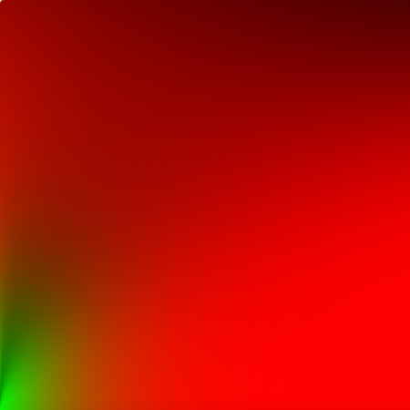

## TODO

- [x] Introduce IBL problem using rendering equation
- [x] Talk about difficulty performing monte carlo integration naively
- [x] Talk about solution of importance sampling
- [x] Introduce past work from Karis on solving the equation offline
- [x] Talk about problem with single single scattering as roughness increases
  - Furnace test
- [x] Talk about recent attempts to address problem, introduce Fdez Aguera
- [x] Show implementation
- [ ] Show comparisons for furnace and in pisa
- [ ] Investigate PI in the denominator of the diffuse part of the equation
- [ ] Add conclusion
- [ ] Add further work
- [ ] Add missing screenshots
- [ ] Decide whether this needs to be split up into two blog posts or not
- [ ] Edit! Consider where we figures might help explain things

## Introduction and Background

Recently I decided to implement image based lighting in BGFX, since I had never implemented image based lighting before and it's a great way to get assets authored for PBR looking really great. However, reading [Karis's 2014 paper](https://cdn2.unrealengine.com/Resources/files/2013SiggraphPresentationsNotes-26915738.pdf) explaining Unreal's PBR implementation, I realized the task would require quite a bit of work. I'll discuss the challenge more later, but let's first introduce the problem a bit more formally. Let's consider equation for evaluating the reflectance of an opaque surface:

$$
L_o(\mathbf{v}, \mathbf{p}) = \int_{\Omega} f_{\text{brdf}}(\mathbf{v}, \mathbf{l}, \mathbf{p}) L_i(\mathbf{l}, \mathbf{p}) \langle\mathbf{n} \cdot \mathbf{l}\rangle d\mathbf{l}
$$

Where $\mathbf{v}$ is our viewing angle, $f_{\text{brdf}}(\mathbf{v}, \mathbf{l}, \mathbf{p})$ is our bidirectional reflectance distribution function, $L_i(\mathbf{l}, \mathbf{p})$ is the radiance incident on point $\mathbf{p}$ from direction $-\mathbf{l}$, and $\mathbf{n}$ is the normal vector at point $\mathbf{p}$.

For our BRDF, we will take the popular approach of using a Lambertian diffuse lobe and Cook-Torrance microfacet model for our specular lobe:

$$
\begin{aligned}
f_{\text{brdf}}(\mathbf{v}, \mathbf{l}) &= f_{\text{specular}}(\mathbf{v}, \mathbf{l}) + f_{\text{diffuse}},
\\\\
f_{\text{specular}}(\mathbf{v}, \mathbf{l}) &=
    \frac{
        D(\mathbf{h}) F(\mathbf{v}\cdot\mathbf{h}) G(\mathbf{v},\mathbf{l},\mathbf{h})
    }{
        4 \langle\mathbf{n}\cdot\mathbf{l}\rangle \langle\mathbf{n}\cdot\mathbf{v}\rangle
    },
\\
f_{\text{diffuse}} &= \frac{c_{\text{diff}}}{\pi},
\end{aligned}
$$

Where $\mathbf{h}$ is the halfway vector, halfway between $\mathbf{l}$ and $\mathbf{v}$. This direction is important, as our normal distribution function (NDF, represented by $D$) tells us what proportion of our perfectly reflecting microfacets will have normals aligned with $\mathbf{h}$, therefore reflecting the light from $-\mathbf{l}$ in the direction $\mathbf{v}$. $F$ is the Fresnel term which defines what proportion of light is reflected as opposed to refracted into the surface. $G$ is the "self shadowing term", which basically defines what proportion of our microfacets will be occluded by the surrounding surface in the direction $\mathbf{l}$.

For more detail on this model, there are many resources but [Naty Hoffman's talk](https://blog.selfshadow.com/publications/s2013-shading-course/hoffman/s2013_pbs_physics_math_slides.pdf) from this [2013 Siggraph workshop](https://blog.selfshadow.com/publications/s2013-shading-course/) is very helpful in explaining this BRDF if you've never seen it before. I'll also come back and explicitly define the functions we're using for $D$, $G$ and $F$ below.

For the constant diffuse term, we'll be using the [GLTF spec](https://github.com/KhronosGroup/glTF/blob/master/specification/2.0/README.md#materials) for determining $c_{\text{diff}}$, which allows for a single albedo texture used by both metals and dielectrics:

```glsl
const float DIELECTRIC_SPECULAR = 0.04;
diffuseColor = lerp(albedo.rgb * (1 - DIELECTRIC_SPECULAR), vec3(0.0), metalness)
```

To make sure there's no ambiguity, we're using the following functions for $D$, $G$, and $F$. For the normal distribution function $D$, we're using the [GGX](https://cdn2.unrealengine.com/Resources/files/2013SiggraphPresentationsNotes-26915738.pdf) formulation:

$$
D(\mathbf{h}) = \frac{
    \alpha^2
}{
    \pi ((\mathbf{n}\cdot\mathbf{h})^2(\alpha^2 - 1) + 1)^2
}
$$

where $\alpha = \text{roughness}^2$. Roughness, AKA perceptually linear roughness, will be an input into our shading model, stored as a channel in our textures.

Meanwhile, for our geometric shadowing/attenuation term $G$ we're using the height correlated Smith function for GGX:

$$
\begin{aligned}
V(\mathbf{v}, \mathbf{l}) &=
\frac{
    G(\mathbf{v},\mathbf{l},\mathbf{h})
}{
    4 \langle\mathbf{n}\cdot\mathbf{l}\rangle \langle\mathbf{n}\cdot\mathbf{v}\rangle
},
\\
V(\mathbf{v}, \mathbf{l}) &= \frac{0.5}{
    \langle \mathbf{n}\cdot\mathbf{l} \rangle \sqrt{(\mathbf{n}\cdot\mathbf{v})^2 (\alpha^2 - 1) + \alpha^2}
+
    \langle \mathbf{n}\cdot\mathbf{v} \rangle \sqrt{(\mathbf{n}\cdot\mathbf{l})^2 (\alpha^2 - 1) + \alpha^2}
}
\end{aligned}
$$

Notice we've expressed this in a way that incorporates the denominator of the BRDF into our $V$ term. For more detail on this term, please see [this section](https://google.github.io/filament/Filament.html#materialsystem/specularbrdf) of the Filament documentation.

Finally, our Fresnel term will use the Schlick approximation:

$$
\begin{aligned}
F(\mathbf{v}, \mathbf{l}) &= F_0 + (1 - F_0)(1 - \langle \mathbf{v} \cdot \mathbf{h} \rangle)^5
\\ &= F_0 (1 - (1 - \langle \mathbf{v} \cdot \mathbf{h} \rangle)^5) + (1 - \langle \mathbf{v} \cdot \mathbf{h} \rangle)^5
\end{aligned}
$$

Where $F_0$ is a material property representing the specular reflectance at incident angles ($\mathbf{l} = \mathbf{n}$). For dielectrics, this is taken to be a uniform 4% as per the [GLTF spec](https://github.com/KhronosGroup/glTF/blob/master/specification/2.0/README.md#materials), while for metals we can use the albedo channel in the texture:

```glsl
F_0 = lerp(vec3(DIELECTRIC_SPECULAR), albedo.rgb, metalness);
```

## Integrating for Image Based Lighting

Okay, so that's our BRDF and the rendering equation we're trying to solve for every pixel we evaluate for our mesh. Let's turn our attention now to the hemisphere $\Omega$ we need to integrate across. In order to do so, we need to be able to evaluate $L_i(\mathbf{l}, \mathbf{p})$ for any given $\mathbf{l}$. In real time applications, we have two approaches, often used together:

1. Describe $L_i(\mathbf{l}, \mathbf{p})$ using a set of $N$ analytical lights. Then, we only need to evaluate the integral N times, for each corresponding light direction $\mathbf{l}_i$.
2. Describe $L_i(\mathbf{l}, \mathbf{p})$ using an _environment map_, often using a [_cube map_](https://en.wikipedia.org/wiki/Cube_mapping).

We'll be focused on item 2 in this post. While an environment map can provide much more realistic lighting, the naive evaluation of our hemispherical integral is not going to cut it for interactive computer graphics. To gain a quick understanding of the challenges involved, consider the following:

- With a typical microfacet model we have both specular and diffuse lobes.
- The Lambertian lobe is dependent on light incoming from every part of our hemisphere.
- For the specular lobe, our roughness will determine what parts of the hemisphere are most important.
- To sample the hemisphere naively, we'll need potentially hundreds/thousands of texture reads.
- Additionally, each sample will require evaluation of the BRDF, which for the specular component, is not cheap.

Doing this all with every draw call is not going to cut it for anything but the simplest of scenes. Additionally, sometimes we'll be redoing work -- for instance, calculating the diffuse irradiance for each direction really only needs to happen once for each environment map!

So instead of doing all that in every frame, we're going to try to pre-compute as many parts of the integral as possible. In order to do so, we'll need to identify what we can precalculate and have to make some approximations!

## Importance Sampling

In order to integrate our radiance equation, we'll need to numerically integrate across our hemisphere. Using the Monte Carlo with importance sampling will provide the following equation:

$$
\int_{\Omega} f_{\text{brdf}}(\mathbf{v}, \mathbf{l}, \mathbf{p}) L_i(\mathbf{l}, \mathbf{p}) \langle\mathbf{n} \cdot \mathbf{l}\rangle d\mathbf{l}
\approx
\frac{1}{N} \sum_{k=1}^{N} \frac{f_{\text{brdf}}(\mathbf{v}, \mathbf{l}_k, \mathbf{p}) L_i(\mathbf{l}_k, \mathbf{p}) \langle\mathbf{n} \cdot \mathbf{l}_k\rangle}{\text{pdf}(\mathbf{v}, \mathbf{l}_k)}
$$

Where $\text{pdf}(\mathbf{v}, \mathbf{l}_k)$ is the probability distribution function we use for sampling our hemisphere. Intuitively, the idea behind having the PDF in the denominator is that if a direction is more likely to be sampled than others, it should contribute less to the sum than a direction that is incredibly unlikely to be chosen.

We could naively sample our hemisphere randomly, but at low roughness our specular component will converge to the actual solution very slowly. The same is true if we attempt to sample our hemisphere uniformly. To reason about this, consider a roughness close to zero, which corresponds to a perfect reflector. In this case, the only light direction that matters is the direction of perfect reflection $\mathbf{l}_{\text{reflection}}$ from $\mathbf{v}$ based on $\mathbf{n}$. _Every other direction will contribute nothing to our sum_. And if we do manage to sample $\mathbf{l}_{\text{reflection}}$, we still won't converge due to the $\frac{1}{N}$ term. At hight roughness, this is less of a factor as the distribution of our microfacet normals will increase, and we'll have to consider most parts of our hemisphere.

So instead, we'll choose a PDF that resembles our BRDF in order to decrease the variance. We'll actually choose our Normal Distribution Function $D$ as our PDF, the reasoning being that the NDF determines which directions contribute the most to the light leaving our larger surface patch. More correctly, we'll actually be sampling $D(\mathbf{h})\langle( \mathbf{n} \cdot \mathbf{h} )$, since [this is how the normal distribution is actually defined]()\rangle

$$
\int_\Omega D(\mathbf{h}) \langle \mathbf{n} \cdot \mathbf{h} \rangle d\mathbf{l}s = 1
$$

If we want our PDF to be used for $\mathbf{l}$ instead of the half vector $\mathbf{h}$ then we'll need to include the Jacobian of the transformation from half vector to $\mathbf{l}$, $J(\mathbf{h})$:

$$
J(\mathbf{h}) = \frac{1}{4\langle \mathbf{v} \cdot \mathbf{h} \rangle}
$$

$$
\text{pdf}(\mathbf{v}, \mathbf{l}_k) = \frac{D(\mathbf{h}) \langle \mathbf{n} \cdot \mathbf{h} \rangle}{4\langle \mathbf{v} \cdot \mathbf{h} \rangle}
$$

You can also read the [Walter et al. 2007](http://www.cs.cornell.edu/~srm/publications/EGSR07-btdf.pdf) paper on this as well as [Legarde et al's course notes](https://seblagarde.files.wordpress.com/2015/07/course_notes_moving_frostbite_to_pbr_v32.pdf) if you'd like more detail.

I also want to note that we won't be sampling $\mathbf{l}$ directly and instead we'll sample our microfacet normal $\mathbf{h}$, treating each microfacet as a perfect reflector to find the relevant $\mathbf{l}$. To do so, we'll need to map two uniformly random variables in the interval $[0, 1)$, let's call them $\xi_1, \xi_2$, to $\phi$ and $\theta$ in spherical coordinates. Then, we can turn our $\phi, \theta$ into a cartesian direction $\mathbf{h}_i$ in world space. We can then use this to find $\mathbf{l}$ to sample our environment map to evaluate $L_i$.

The mapping from $\xi_1, \xi_2$ to $\phi$ and $\theta$ won't be derived here, but [Tobias Franke](https://www.tobias-franke.eu/log/2014/03/30/notes_on_importance_sampling.html) and [AGraphicsGuy](https://agraphicsguy.wordpress.com/2015/11/01/sampling-microfacet-brdf/) have good blog posts that break this down step by step. The final result are the following equations:

$$
\phi = 2 * \pi * \xi_1
\theta = \arccos \sqrt{\frac{1 - \xi_2}{\xi_2(\alpha^2 - 1) + 1}}
$$

Note that this assumes we're restricting ourselves to an isotropic version of the GGX, which is why the $\phi$ term is just randomly sampled. Note the $\alpha$ term in our equation for $\phi$, but it may not be obvious how this dependency causes the equation to behave. I created a [little Desmos demo](https://www.desmos.com/calculator/ueuitucusv) that you can play around with to get a sense of how this maps our $\xi_2$ to $\theta$. Notice that at low roughnesses, most of the $[0, 1)$ range will map to a small $\theta$, while at larger roughnesses we approach a standard cosine distribution, and we're much more likely to get larger angles.

Okay so, we now have a method of importance sampling for the entire range of roughness values. Here's some GLSL code that shows how we could sample a quasi-random direction $\mathbf{l_i}$:

```glsl
// Taken from https://github.com/SaschaWillems/Vulkan-glTF-PBR/blob/master/data/shaders/genbrdflut.frag
// Based on http://holger.dammertz.org/stuff/notes_HammersleyOnHemisphere.html
vec2 hammersley(uint i, uint N)
{
    uint bits = (i << 16u) | (i >> 16u);
    bits = ((bits & 0x55555555u) << 1u) | ((bits & 0xAAAAAAAAu) >> 1u);
    bits = ((bits & 0x33333333u) << 2u) | ((bits & 0xCCCCCCCCu) >> 2u);
    bits = ((bits & 0x0F0F0F0Fu) << 4u) | ((bits & 0xF0F0F0F0u) >> 4u);
    bits = ((bits & 0x00FF00FFu) << 8u) | ((bits & 0xFF00FF00u) >> 8u);
    float rdi = float(bits) * 2.3283064365386963e-10;
    return vec2(float(i) /float(N), rdi);
}

// Based on Karis 2014
vec3 importanceSampleGGX(vec2 Xi, float roughness, vec3 N)
{
    float a = roughness * roughness;
    // Sample in spherical coordinates
    float phi = 2.0 * PI * Xi.x;
    float cosTheta = sqrt((1.0 - Xi.y) / (1.0 + (a * a - 1.0) * Xi.y));
    float sinTheta = sqrt(1.0 - cosTheta * cosTheta);
    // Construct tangent space vector
    vec3 H;
    H.x = sinTheta * cos(phi);
    H.y = sinTheta * sin(phi);
    H.z = cosTheta;

    // Tangent to world space
    vec3 upVector = abs(N.z) < 0.999 ? vec3(0.0, 0.0, 1.0) : vec3(1.0, 0.0, 0.0);
    vec3 tangentX = normalize(cross(upVector, N));
    vec3 tangentY = cross(N, tangentX);
    return tangentX * H.x + tangentY * H.y + N * H.z;
}
```

One thing in the above code I did not touch on at all is the Hammersley sequence, which is the method by which we create our random numbers $\xi_1, \xi_2$. It's a low-discrepancy sequence that I won't do any justice describing, so here's a [wikipedia link](https://en.wikipedia.org/wiki/Low-discrepancy_sequence#Hammersley_set).

Now that we can importance sample our hemisphere, we can now turn our attention back to the radiance equation and see which bits we can calculate and store to cut down on the amount of work we need to do each frame.

## Split Sum Approximation

In [Karis's presentation on the Unreal Engine PBR pipeline](), he explains that we can actually approximate the specular part of our radiance sum by splitting it in two:

$$
\frac{1}{N} \sum_{k=1}^{N}
\frac{
    f_s(\mathbf{v}, \mathbf{l}_k, \mathbf{p}) L_i(\mathbf{l}_k, \mathbf{p}) \langle\mathbf{n} \cdot \mathbf{l}_k\rangle
}{
    \text{pdf}(\mathbf{v}, \mathbf{l}_k)
} \approx
    \left( \frac{1}{N} \sum_{k=1}^{N (\mathbf{n} \cdot \mathbf{l}_k)} L_i(\mathbf{l}_k, \mathbf{p}) \right)
    \left( \frac{1}{N} \sum_{k=1}^{N} \frac{f_s(\mathbf{v}, \mathbf{l}_k, \mathbf{p}) \langle\mathbf{n} \cdot \mathbf{l}_k\rangle}{\text{pdf}(\mathbf{v}, \mathbf{l}_k)} \right)
$$

As Karis notes, this approximation is exact for a constant $L_i$ term, and reasonable for "common environments". The way this approximation helps us is that we can store the two different sums separately!

### Pre-filtered Environment Map

The first sum is what's commonly referred to as the "Pre-filtered Environment Map" or just the "radiance map" in other papers. When we say "pre-filtering", what we're actually doing is evaluating and storing a value such that when we go to render our mesh, we can simply sample this stored value to obtain $L_i$. The idea is that we can skip having to integrate across our hemisphere in order to figure out the incident radiance on our point. Interestingly, Karis and others convolve this integral with the GGX by still using the GGX based importance sampling. This improves convergence, which is important if you're planning on having your environment map change over time and need to re-evaluate it outside the context of an offline pipeline. However, one big problem with this is that the GGX NDF is dependent on $\mathbf{v}$ -- which creates "stretchy" reflections. Karis approximates the NDF as _isotropic_ where $\mathbf{n} = \mathbf{v}$. This is a much larger source of error than the split sum, and is demonstrated by the figure below:


Notice the anisotropic reflections on the right that we lose with the approximation. Taken from the [_Moving Frostbite to PBR_ course notes](https://seblagarde.files.wordpress.com/2015/07/course_notes_moving_frostbite_to_pbr_v32.pdf). While the error is large, it's the price we must pay to be able to perform this sum outside of our render loop when $\mathbf{v}$ is known.

We can further improve the rate of convergence by filtering our _samples_ as well. The idea is described in detail in [Křivánek and Colbert's GPU Gems article](https://developer.nvidia.com/gpugems/GPUGems3/gpugems3_ch20.html) and I will provide a quick summary. When using our importance sampling routine, we evaluate the PDF value for the sample, and if it is "small" then this corresponds to a direction we sample inequently. As a result, we can model this as sampling a larger solid angle in our hemisphere. The inverse is also true: samples with higher PDF values will correspond to smaller solid angles. But how do we sample a larger or small solid angle in our environment without just having to integrate again? Well we can use the mip map chain of the environment map! It's a very clever trick, and it lets us use even fewer samples.

When it comes to storing the pre-filtered environment map, it's important to note once again that we're creating a different map for different roughness levels of our choosing. Since we'll lose high frequency information as roughness increases, we can actually use mip map layers to store the filtered map, with higher roughnesses corresponding to higher mip levels.

In BGFX, I implemented this using compute shaders, with a different pass for each roughness/mip level. To perform this on a cube map, I'm using thread groups with a third dimension corresponding to a face of the cube. I'm not certain this is actually a good idea as it result in poor coherency, but I didn't have time to benchmark against just dispatching a different job for each face. This is left as an exercise for the reader.

Here's the dead simple loop used in the application code to issue each dispatch call:

```cpp
// width is the width/length of a single face of our cube map
float maxMipLevel = bx::log2(float(width));
for (float mipLevel = 0; mipLevel <= maxMipLevel; ++mipLevel)
{
    uint16_t mipWidth = width >> uint16_t(mipLevel);
    float roughness = mipLevel / maxMipLevel;
    float params[] = { roughness, mipLevel, float(width), 0.0f };
    bgfx::setUniform(u_params, params);
    // Bind the source using a Sampler, so we don't have to perform the cube mapping ourselves
    bgfx::setTexture(0, u_sourceCubeMap, sourceCubeMap);
    // Set the image using a specific mipLevel
    bgfx::setImage(1, filteredCubeMap, uint8_t(mipLevel), bgfx::Access::Write, bgfx::TextureFormat::RGBA16F);
    // Dispatch enough groups to cover the entire _mipped_ face
    bgfx::dispatch(view, preFilteringProgram, mipWidth / threadCount, mipWidth / threadCount, 1);
}
```

Then our computer shader looks like the following:

```glsl
#include "bgfx_compute.sh"

// Contains our hammersley sequence and our importance sampling function
#include "pbr_helpers.sh"

#define PI 3.141592653589793

#define THREADS 8
#define NUM_SAMPLES 64u

// u_params.x == roughness
// u_params.y == mipLevel
// u_params.z == imageSize
uniform vec4 u_params;

SAMPLERCUBE(s_source, 0);
IMAGE2D_ARRAY_WR(s_target, rgba16f, 1);

// Reverse lookup from uvw to world coords
vec3 toWorldCoords(ivec3 globalId, float size)
{
    vec2 uvc = (vec2(globalId.xy) + 0.5) / size;
    uvc = 2.0 * uvc - 1.0;
    uvc.y *= -1.0;
    switch (globalId.z) {
    case 0:
        return vec3(1.0, uvc.y, -uvc.x);
    case 1:
        return vec3(-1.0, uvc.y, uvc.x);
    case 2:
        return vec3(uvc.x, 1.0, -uvc.y);
    case 3:
        return vec3(uvc.x, -1.0, uvc.y);
    case 4:
        return vec3(uvc.x, uvc.y, 1.0);
    default:
        return vec3(-uvc.x, uvc.y, -1.0);
    }
}

// From Karis, 2014
vec3 prefilterEnvMap(float roughness, vec3 R, float imgSize)
{
    // Isotropic approximation: we lose stretchy reflections :(
    vec3 N = R;
    vec3 V = R;

    vec3 prefilteredColor = vec3_splat(0.0);
    float totalWeight = 0.0;
    for (uint i = 0u; i < NUM_SAMPLES; i++) {
        vec2 Xi = hammersley(i, NUM_SAMPLES);
        vec3 H = importanceSampleGGX(Xi, roughness, N);
        float VoH = dot(V, H);
        float NoH = VoH; // Since N = V in our approximation
        // Use microfacet normal H to find L
        vec3 L = 2.0 * VoH * H - V;
        float NoL = saturate(dot(N, L));
        // Clamp 0 <= NoH <= 1
        NoH = saturate(NoH);

        if (NoL > 0.0) {
            // Based off https://developer.nvidia.com/gpugems/GPUGems3/gpugems3_ch20.html
            // Typically you'd have the following:
            // float pdf = D_GGX(NoH, roughness) * NoH / (4.0 * VoH);
            // but since V = N => VoH == NoH
            float pdf = D_GGX(NoH, roughness) / 4.0 + 0.001;
            // Solid angle of current sample -- bigger for less likely samples
            float omegaS = 1.0 / (float(NUM_SAMPLES) * pdf);
            // Solid angle of texel
            float omegaP = 4.0 * PI / (6.0 * imgSize * imgSize);
            // Mip level is determined by the ratio of our sample's solid angle to a texel's solid angle
            float mipLevel = max(0.5 * log2(omegaS / omegaP), 0.0);
            prefilteredColor += textureCubeLod(s_source, L, mipLevel).rgb * NoL;
            totalWeight += NoL;
        }
    }
    return prefilteredColor / totalWeight;
}

// Notice the 6 in the Z component of our NUM_THREADS call
// This allows us to index the faces using gl_GlobalInvocationID.z
NUM_THREADS(THREADS, THREADS, 6)
void main()
{
    float mipLevel = u_params.y;
    float imgSize = u_params.z;
    float mipImageSize = imgSize / pow(2.0, mipLevel);
    ivec3 globalId = ivec3(gl_GlobalInvocationID.xyz);

    if (globalId.x >= mipImageSize || globalId.y >= mipImageSize)
    {
        return;
    }

    vec3 R = normalize(toWorldCoords(globalId, mipImageSize));

    // Don't need to integrate for roughness == 0, since it's a perfect reflector
    if (u_params.x == 0.0) {
        vec4 color = textureCubeLod(s_source, R, 0);
        imageStore(s_target, globalId, color);
        return;
    }

    vec3 color = prefilterEnvMap(u_params.x, R, imgSize);
    // We access our target cubemap as a 2D texture array, where z is the face index
    imageStore(s_target, globalId, vec4(color, 1.0));
}
```

I also wrote a [small ShaderToy example](https://www.shadertoy.com/view/WtBSRR) that lets you visualize this for different levels of roughness. The mouse allows you to change the roughness amount. Let's take a look at the resulting output for the [Pisa environment map]():

TODO: Insert environment map

### Environment BRDF

Okay, so that's one sum taken care of, now let's look at the second sum. Once again, our goal here is to try and pre-calculate as much of this sum as possible and store it such that we can resolve the integral without having to perform tens/hundreds of texture lookups.

$$
\frac{1}{N} \sum_{k=1}^{N}
    \frac{
        f_s(\mathbf{v}, \mathbf{l}_k, \mathbf{p}) \langle\mathbf{n} \cdot \mathbf{l}_k\rangle
    }{
        \text{pdf}(\mathbf{v}, \mathbf{l}_k)
    }
$$

Let's take a look at it with our specular BRDF and the $\text{pdf}$ subbed in:

$$
\frac{1}{N} \sum_{k=1}^{N}
    \frac{
        D(\mathbf{h}) F(\mathbf{v}\cdot\mathbf{h}) G(\mathbf{v},\mathbf{l},\mathbf{h})
    }{
        4 \langle\mathbf{n}\cdot\mathbf{l_k}\rangle \langle\mathbf{n}\cdot\mathbf{v}\rangle
    }
    \frac{4 \langle \mathbf{v} \cdot \mathbf{h} \rangle
    }{
        D(\mathbf{h}) \langle \mathbf{n} \cdot \mathbf{h} \rangle
    }  \langle\mathbf{n} \cdot \mathbf{l}_k\rangle
= \frac{1}{N} \sum_{k=1}^{N}
    F(\mathbf{v}\cdot\mathbf{h})
    \frac{
        G(\mathbf{v},\mathbf{l},\mathbf{h}) \langle \mathbf{v} \cdot \mathbf{h} \rangle
    }{
        \langle\mathbf{n}\cdot\mathbf{v}\rangle \langle \mathbf{n} \cdot \mathbf{h} \rangle
    }
$$

At this point, we've managed to factor out the NDF but our sum is still dependent on both $\mathbf{v}$, $\text{roughness}$ (through the $G$ term) and $F_0$ (through the Fresnel term). The $F0$ term in particular is annoying, because each material will have a potentially different $F0$ term, but we don't want to have to store a different LUT for each material. But let's substitute our Schlick's Fresnel equation and moving things around a bit:

$$
\begin{aligned}
= &F_0 \left(\frac{1}{N} \sum_{k=1}^{N}
    \frac{
        G(\mathbf{v},\mathbf{l}_k,\mathbf{h}_k) \langle \mathbf{v} \cdot \mathbf{h}_k \rangle
    }{
        \langle\mathbf{n}\cdot\mathbf{v}\rangle \langle \mathbf{n} \cdot \mathbf{h}_k \rangle
    }
    (1 - (1 - \langle \mathbf{v} \cdot \mathbf{h}_k \rangle)^5)
\right)
\\
& + \left(
        \frac{1}{N} \sum_{k=1}^{N}
        \frac{
            G(\mathbf{v},\mathbf{l}_k,\mathbf{h}_k) \langle \mathbf{v} \cdot \mathbf{h}_k \rangle
        }{
            \langle\mathbf{n}\cdot\mathbf{v}\rangle \langle \mathbf{n} \cdot \mathbf{h}_k \rangle
        }
        (1 - \langle \mathbf{v} \cdot \mathbf{h}_k \rangle)^5 \right)
\\
= &F_0 k_a + k_b
\end{aligned}
$$

Where $k_a, k_b$ are the _scale_ and the _bias_ terms applied to $F_0$. You may ask yourself what we have accomplished by doing all this, but notice that $k_a, k_b$ are only dependent on $\text{roughness}$ and $\mathbf{h}_k$/$\mathbf{l}_k$ (recall that we sample $\mathbf{h}_k$ to find $\mathbf{l}_k$). For $\mathbf{n}$ we'll set it to some constant (like the positive z-direction). We can then create a two dimensional LUT where the x-axis is $\langle \mathbf{n} \cdot \mathbf{v} \rangle$ and the y-axis is $\text{roughness}$. The red channel of this LUT will be $k_a$ while the green channel will be $k_b$.

So here's what that looks like as a texture:

TODO: insert texture

I used a compute shader that just gets run once and the resulting LUT is stored in a RG16F texture. Here's the compute shader code to perform the calculation:

```glsl
#include "bgfx_compute.sh"
#include "pbr_helpers.sh"

#define GROUP_SIZE 256
#define THREADS 16

IMAGE2D_WR(s_target, rg16f, 0);

// Karis 2014
vec2 integrateBRDF(float linearRoughness, float NoV)
{
	vec3 V;
    V.x = sqrt(1.0 - NoV * NoV); // sin
    V.y = 0.0;
    V.z = NoV; // cos

    // N points straight upwards for this integration
    const vec3 N = vec3(0.0, 0.0, 1.0);

    float A = 0.0;
    float B = 0.0;
    const uint numSamples = 1024;

    for (uint i = 0u; i < numSamples; i++) {
        vec2 Xi = hammersley(i, numSamples);
        // Sample microfacet direction
        vec3 H = importanceSampleGGX(Xi, linearRoughness, N);

        // Get the light direction
        vec3 L = 2.0 * dot(V, H) * H - V;

        float NoL = saturate(dot(N, L));
        float NoH = saturate(dot(N, H));
        float VoH = saturate(dot(V, H));

        if (NoL > 0.0) {
            float G = G_Smith(NoV, NoL, linearRoughness);
            float G_Vis = G * VoH / (NoH * NoV);
            float Fc = pow(1.0 - VoH, 5.0);
            A += (1.0 - Fc) * G_Vis;
            B += Fc * G_Vis;
        }
    }

    return vec2(A, B) / float(numSamples);
}


NUM_THREADS(THREADS, THREADS, 1)
void main()
{
    // Normalized pixel coordinates (from 0 to 1)
    vec2 uv = vec2(gl_GlobalInvocationID.xy + 1) / vec2(imageSize(s_target).xy);
    float mu = uv.x;
    float a = uv.y;


    // Output to screen
    vec2 res = integrateBRDF(a, mu);

    // Scale and Bias for F0 (as per Karis 2014)
    imageStore(s_target, ivec2(gl_GlobalInvocationID.xy), vec4(res, 0.0, 0.0));
}

```

This shader is a bit simpler than the last, since we don't have to write to a cube map this time. I also wrote a [ShaderToy](https://www.shadertoy.com/view/3lXXDB) for this example as well, which shows you what the output looks like. Note that these outputs will be in RGBA8, so probably aren't suitable for direct use (i.e. you can't use the screen cap as an LUT). The two values smoothly vary and as such we can get away with a fairly small LUT. In my BGFX code I store it in 64x64 texture.



## Preliminary Results

Now that we have a prefiltered environment map and a LUT for most parts of our BRDF, and our diffuse irradiance map, all we have to do is put it together.

$$
\int_{\Omega} f_{\text{brdf}}(\mathbf{v}, \mathbf{l}, \mathbf{p}) L_i(\mathbf{l}, \mathbf{p}) \langle\mathbf{n} \cdot \mathbf{l}\rangle d\mathbf{l}
\approx
\left( F_0 k_a + k_b \right) \text{radiance} + \frac{c_{\text{diff}}}{\pi} \text{irradiance}
$$

Where $k_a, k_b$ are the values stored in our lookup table, $\text{radiance}$ is the prefiltered environment map, \text{irradiance} is the irradiance map, $F_0$ and $c_{\text{diff}}$ are material properties for Specular color and diffuse color respectively. Here's the fragment shader code as well:

```glsl
$input v_position, v_normal, v_tangent, v_bitangent, v_texcoord

#include "../common/common.sh"
#include "pbr_helpers.sh"

#define DIELECTRIC_SPECULAR 0.04
#define BLACK vec3(0.0, 0.0, 0.0)

// Scene
uniform vec4 u_envParams;
#define numEnvLevels u_envParams.x

uniform vec4 u_cameraPos;

// Material
SAMPLER2D(s_diffuseMap, 0);
SAMPLER2D(s_normalMap, 1);
SAMPLER2D(s_metallicRoughnessMap, 2);

// IBL Stuff
SAMPLER2D(s_brdfLUT, 3);
SAMPLERCUBE(s_prefilteredEnv, 4);
SAMPLERCUBE(s_irradiance, 5);

void main()
{
    mat3 tbn = mat3FromCols(
        normalize(v_tangent),
        normalize(v_bitangent),
        normalize(v_normal)
    );
    vec3 normal = texture2D(s_normalMap, v_texcoord).xyz * 2.0 - 1.0;
    normal = normalize(mul(tbn, normal));

    vec3 viewDir = normalize(u_cameraPos.xyz - v_position);
    vec3 lightDir = reflect(-viewDir, normal);
    vec3 H = normalize(lightDir + viewDir);
    float NoV = clamp(dot(normal, viewDir), 1e-5, 1.0);

    // Material properties
    vec4 baseColor = texture2D(s_diffuseMap, v_texcoord);
    vec3 OccRoughMetal = texture2D(s_metallicRoughnessMap, v_texcoord).xyz;
    float occlusion = OccRoughMetal.x;
    float roughness = OccRoughMetal.y;
    float metalness = OccRoughMetal.z;
    // According to GLTF spec
    vec3 F0 = mix(vec3_splat(DIELECTRIC_SPECULAR), baseColor.xyz, metalness);
    float diffuseColor = mix(
        baseColor.rgb * (1.0 - DIELECTRIC_SPECULAR),
        BLACK,
        metalness
    );

    vec2 f_ab = texture2D(s_brdfLUT, vec2(NoV, roughness)).xy;
    // Select appropriate prefiltered environment map based on roughness
    float lodLevel = roughness * numEnvLevels;
    vec3 radiance = textureCubeLod(s_prefilteredEnv, lightDir, lodLevel).xyz;
    vec3 irradiance = textureCubeLod(s_irradiance, normal, 0).xyz;

    vec3 color = (F0 * k_ab.x + k_ab.y) * radiance + (diffuseColor) * irradiance / PI;

    color = occlusion * color * baseColor.w;
    gl_FragColor = vec4(color, baseColor.w);
}
```

You might notice that both the value for `F0` and for `diffuseColor` are derived using the constant `DIELECTRIC_SPECULAR`, which is set to `0.04`. This is from the [GLTF spec](https://github.com/KhronosGroup/glTF/tree/master/specification/2.0#metallic-roughness-material), which uses this value for all dielectrics rather than storing an additional value.

So let's take a look at the results! Here's a render of spheres of increasing roughness (from left to right) that uses the [Pisa courtyard environment map](http://gl.ict.usc.edu/Data/HighResProbes/):

TODO: Insert Render of balls

We can see how as the roughness increases, we're using our blurrier roughness maps. However, you may also be able to notice that as roughness increases, the metal spheres become darker. One way we can demonstrate this fully is to render the spheres in a totally white environment, where $L_i(\mathbf{l}) = 1$ for all directions $\mathbf{l}$. This is also commonly referred to as a "furnace test":

TODO: Insert render of "furnace test"

Here's it's very obvious that something is amiss. Physically, there's no reason why our metal would become this much darker even as roughness increases. The reason this is occurring within our model is that we are using a first order approximation which includes only the single scattering events. In reality, light will scatter several times across the surface, as demonstrated in this illustration:

TODO: Insert illustration from paper or naty hoffman's talk or something

As the material becomes rougher, the multiscattering events account for a larger proportion of the reflected energy, and our approximation break down.

## Accounting for Multi-scattering Events

Luckily for us, there's been a significant amount of work done on improving our approximation in order to somehow account for multiple scattering events. [Heitz et al.]() presented their work on modelling the problem as a free-path problem, validating their results by simulating each successive scattering event across triangular meshes using ray tracing. However, their work is too slow for production path tracing, nevermind real time interactive graphics.

In the next few years, [Kulla and Conty](https://blog.selfshadow.com/publications/s2017-shading-course/imageworks/s2017_pbs_imageworks_slides_v2.pdf) presented their own alternative to recovering the energy based on "the furnace test", but it requires additional 2D and 3D LUTs and was meant to be a path tracing solution. Additionally, [Emmanuel Turquin](https://blog.selfshadow.com/publications/turquin/ms_comp_final.pdf) built upon the Heitz paper to model the additional scattering events by noting that Heitz's paper showed the additional scattering events to have lobes resembling smaller versions of the first event's lobe.

Unfortunately none of these solutions are meant for real time, but just this year [Fdez-Agüera](http://www.jcgt.org/published/0008/01/03/paper.pdf) published a paper outlining how we could extend the methods outlined by Karis, without having to introduce any additional LUTs or parameters. The paper provides a full mathematical derivation, but I'll try to provide the highlights.

First, let's consider a perfect reflector with no diffuse lobe, where $F = 1$. In this case, the total amount of energy reflected regardless of number of bounces must always be equal to the incident energy (due to conservation of energy):

$$
1 = E_{ss} + E_{ms} => E_{ms} = 1 - E_{ss}
$$

Where $E_{ss}$ is our directional albedo, but with $F = 1$:

$$
E_{ss} = \int_{\Omega} \frac{
    D(\mathbf{h}) G(\mathbf{v},\mathbf{l},\mathbf{h})
}{
    4 \langle\mathbf{n}\cdot\mathbf{l}\rangle \langle\mathbf{n}\cdot\mathbf{v}\rangle
}  \langle\mathbf{n} \cdot \mathbf{l}\rangle d\mathbf{l}
$$

To define $E_{ms}$, we can express it in the same fashion, but with an unknown BRDF:

$$
E_{ms} = \int_{\Omega} f_{ms} \langle\mathbf{n} \cdot \mathbf{l}\rangle d\mathbf{l} = 1 - E_{ss}
$$

So we could effectively add this additional lobe to our reflectance equation:

$$
\begin{aligned}
L_o(\mathbf{v}, \mathbf{p}) = \int_{\Omega} f_{\text{ss}} + f_{\text{ms}}) L_i(\mathbf{l}, \mathbf{p}) \langle\mathbf{n} \cdot \mathbf{l}\rangle d\mathbf{l}
\\
&= \int_{\Omega} f_{\text{ss}} L_i(\mathbf{l}, \mathbf{p}) \langle\mathbf{n} \cdot \mathbf{l}\rangle d\mathbf{l} + \int_{\Omega} f_{\text{ms}} L_i(\mathbf{l}, \mathbf{p}) \langle\mathbf{n} \cdot \mathbf{l}\rangle d\mathbf{l}
\end{aligned}
$$

We've already discussed the integral on the left, so let's focus exclusively on the second integral. We'll once again use the split sum introduced by Karis, but here Fdez-Agüera makes the assumption that we can consider the secondary scattering events to be mostly diffuse, and therefore use irradiance as a solution to the second integral:

$$
\int_{\Omega} f_{\text{ms}} L_i(\mathbf{l}, \mathbf{p}) \langle\mathbf{n} \cdot \mathbf{l}\rangle d\mathbf{l} = \int_{\Omega} f_{\text{ms}} \langle\mathbf{n} \cdot \mathbf{l}\rangle d\mathbf{l} \int_{\Omega} \frac{L_i(\mathbf{l}, \mathbf{p})}{\pi} \langle\mathbf{n} \cdot \mathbf{l}\rangle d\mathbf{l}
\\
= (1 - E_{ss}) \int_{\Omega} \frac{L_i(\mathbf{l}, \mathbf{p})}{\pi} \langle\mathbf{n} \cdot \mathbf{l}\rangle d\mathbf{l}
$$

Fdez-Agüera further notes that this approximation fails for narrow lights, such as analytical point or directional lights. Interestingly, [Stephen McAuley](http://advances.realtimerendering.com/s2019/index.htm) made the clever observation that this multiscattering term will only dominate at higher roughnesses, where our radiance map is going to be highly blurred and fairly diffuse. His comparison shows little difference, so if you weren't previously using irradiance you could potentially skip it here as well. However we've already created our irradiance map, so we will be using it again here.

And so, if we use the approximation from earlier for the single scattering event, and bring in this approximation for the multiscattering event, we end up with the following:

$$
L_o(\mathbf{v}, \mathbf{p}) = \left( k_a + k_b \right) \text{radiance} + (1 - E_{ss}) \text{irradiance}
$$

Where $k_a, k_b$ are the scale and bias terms from Karis that we've stored in our LUT.

Recall, however, that we've constrained ourselves to a perfectly reflecting metal here. So in order to extend it to generic metals, we need to re-introduce $F$. Like others, Fdez-Agüera splits $F$ into two terms, $F_{ss}$ and $F_{ms}$ such that:

$$
E = F_{ss} E_{ss} + F_{ms} E_{ms}
$$

However, unlike previously, we cannot simply set $E=1$. Instead, Fdez-Agüera models $F_{ms}$ as a geometric series such that:

$$
E = F_{ss} E_{ss} + \sum_{k=1}^{\inf} F_{ss} E_{ss} (1 - E_{\text{avg}})^k F_{\text{avg}}^k =
$$

Where $F_{\text{avg}}$ and $E_{\text{avg}}$ are defined as:

$$
F_{\text{avg}} = F_0 + \frac{1}{21} (1 - F_0), E_{\text{avg}} = E_{ss}
$$

You'll have to check the papers for the details on this I'm afraid, as I don't want to entirely reproduce the paper in this blog post. The conclusion is that we can therefore write our equation for $L_o$ as the following:

$$
L_o(\mathbf{v}, \mathbf{p}) = \left( F_0 k_a + k_b \right) \text{radiance} + \frac{(F_0 k_a + k_b)F_{\text{avg}}}{1 - F_{\text{avg}}(1 - E_{ss})} (1 - E_{ss}) \text{irradiance}
$$

Let's take a second and look at some renders of metals with this new formulation. We should no longer see the darkening as the roughness increases, and the two images below demonstrate that the term mostly succeeds:

TODO: Renders of furnace test split in two

TODO: Renders of pisa split in two

One important thing to mention is that we see an increase in saturation at the higher roughnesses not unlike what [Heitz](), [Kulla and Conty](https://blog.selfshadow.com/publications/s2017-shading-course/imageworks/s2017_pbs_imageworks_slides_v2.pdf) and [Hill](https://blog.selfshadow.com/2018/06/04/multi-faceted-part-1/) see. Whether this is desired behaviour is up to you. It appears Turqin's method does _not_ produce these shifts in saturation, so that may be worth investigation for you if saturation is to be avoided at all cost.

Phew, that's a lot to take in... However, we haven't talked about how diffuse fits into this at all. Let's first examine how dielectrics behave in the furnace test:

TODO: Render of dielectrics in furnace

As we can see, at lower roughnesses the fresnel effect is too strong, and there is still some brightening at higher roughnesses. Luckily, we can continue with our current approach and consider a perfectly white dielectric in the furnace test:

$$
E = 1 = F_{ss} E_{ss} + F_{ms} E_{ms} + E_{\text{diffuse}}
$$

This approximation ignores some of the physical reality of diffuse transmission and re-emission, but Fdez-Agüera makes a good argument for why we can keep ignoring them:

> It doesn’t explicitly model the effects of light scattering back and forth between the diffuse and specular interfaces, but since specular reflectance is usually quite low and unsaturated for dielectrics, radiated energy will eventually escape the surface unaltered, so the approximation holds. [(p. 52)]()

To extend to non-white dielectrics, we can simply multiply it by the diffuse albedo, $c_{\text{diff}}$.

$$
\begin{aligned}
F_{ss}E_{ss} &= \left( F_0 k_a + k_b \right) \times \text{radiance},
\\
F_{ms}E_{ms} &= \frac{E_{ss} F_{\text{avg}}}{1 - F_{\text{avg}}(1 - E_{ss})} (1 - E_{ss}) \times \text{irradiance},
\\
K_d &= c_{\text{diff}} (1 - F_{ss} E_{ss} + F_{ms} E_{ms}) \times \text{irradiance},
\\
L_o &= F_{ss}E_{ss} + F_{ms}E_{ms} + K_d
\end{aligned}
$$

Let's look at our final results:

TODO: Render of dielectrics in furnace
TODO: Render balls with split

And here's the final shader code, using the BRDF LUT, prefitlered environment map, and irradiance map as uniform arguments:

```glsl
$input v_position, v_normal, v_tangent, v_bitangent, v_texcoord

#include "../common/common.sh"
#include "pbr_helpers.sh"

#define DIELECTRIC_SPECULAR 0.04
#define BLACK vec3(0.0, 0.0, 0.0)

// Scene
uniform vec4 u_envParams;
#define numEnvLevels u_envParams.x

uniform vec4 u_cameraPos;

// Material
SAMPLER2D(s_diffuseMap, 0);
SAMPLER2D(s_normalMap, 1);
SAMPLER2D(s_metallicRoughnessMap, 2);

// IBL Stuff
SAMPLER2D(s_brdfLUT, 3);
SAMPLERCUBE(s_prefilteredEnv, 4);
SAMPLERCUBE(s_irradiance, 5);

void main()
{
    mat3 tbn = mat3FromCols(
        normalize(v_tangent),
        normalize(v_bitangent),
        normalize(v_normal)
    );
    vec3 normal = texture2D(s_normalMap, v_texcoord).xyz * 2.0 - 1.0;
    normal = normalize(mul(tbn, normal));

    vec3 viewDir = normalize(u_cameraPos.xyz - v_position);

    vec4 baseColor = texture2D(s_diffuseMap, v_texcoord);
    vec3 OccRoughMetal = texture2D(s_metallicRoughnessMap, v_texcoord).xyz;

    vec3 lightDir = reflect(-viewDir, normal);
    vec3 H = normalize(lightDir + viewDir);
    float NoV = clamp(dot(normal, viewDir), 1e-5, 1.0);

    float roughness = OccRoughMetal.y;
    float metalness = OccRoughMetal.z;
    float occlusion = OccRoughMetal.x;
    vec3 F0 = mix(vec3_splat(DIELECTRIC_SPECULAR), baseColor.xyz, metalness);

    vec2 f_ab = texture2D(s_brdfLUT, vec2(NoV, roughness)).xy;
    float lodLevel = roughness * numEnvLevels;
    vec3 radiance = textureCubeLod(s_prefilteredEnv, lightDir, lodLevel).xyz;
    vec3 irradiance = textureCubeLod(s_irradiance, normal, 0).xyz;

    vec3 Fr = max(vec3_splat(1.0 - roughness), F0) - F0;
    vec3 k_S = F0 + Fr * pow(1.0 - NoV, 5.0);

    vec3 FssEss = k_S * f_ab.x + f_ab.y;

    float Ess = f_ab.x + f_ab.y;
    float Ems = 1.0 - Ess;
    vec3 F_avg = F0 + (1.0 - F0) / 21.0;
    vec3 Fms = FssEss / (1.0 - Ems * F_avg);

    vec3 k_D = baseColor.xyz * (1 - (FssEss + Fms * Ems));
    vec3 color = FssEss * radiance + (Fms * Ems + k_D) * irradiance;

    color = occlusion * color * baseColor.w;
    gl_FragColor = vec4(color, baseColor.w);
}
```

Notice how little code is actually for calculating our new terms -- most of it is just texture reads and setup. Finally, to demonstrate the output with a more complicated mesh (and for a bit of continuity with the other blog posts), let's render the Flight Helmet gltf model:

TODO: Add flight helmet screenshot

While I've included most of the shader code used, the entire example is available [here](https://github.com/bruop/bae) as `04-pbl-ibl`. Note however that it uses non-standard GLTF files, that have had their web-compatible textures swapped out with corresponding DDS files that contain mip maps, generated using the `texturec` tool provided as part of BGFX. BGFX does not provide an easy way to invoke the equivalent of `glGenerateMipmap`, so I've created a little python script to pre-process the GLTF files.
