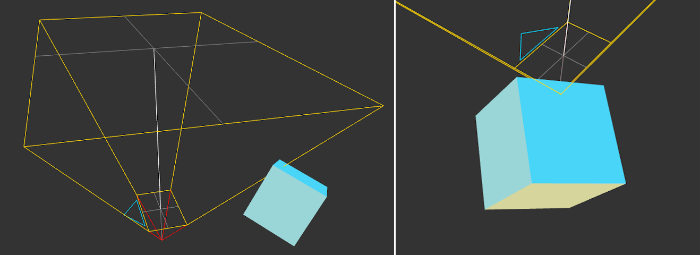
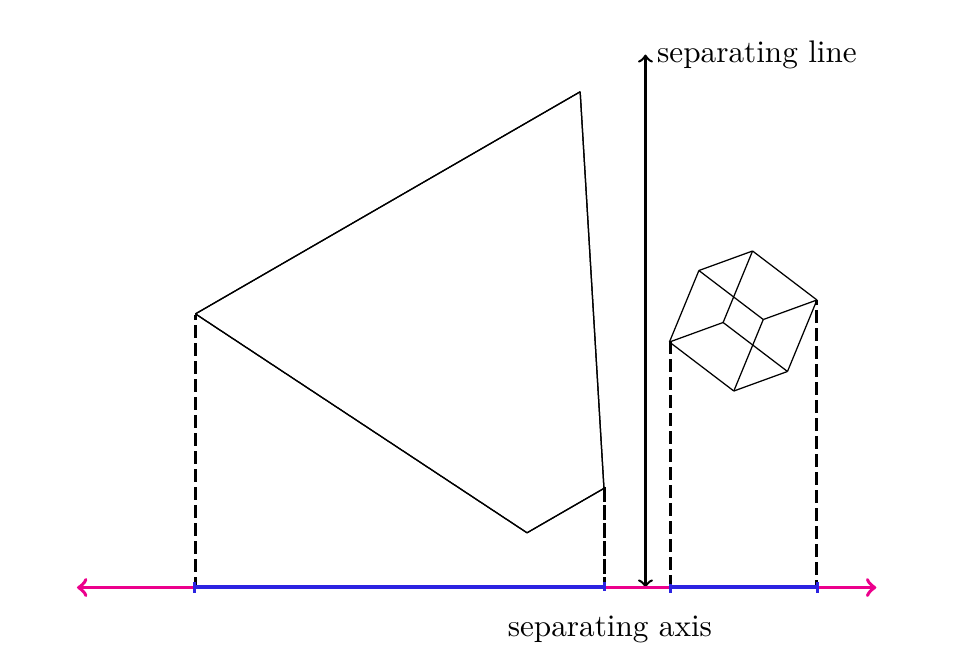
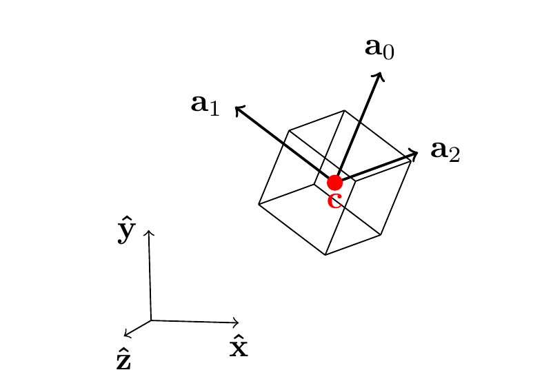
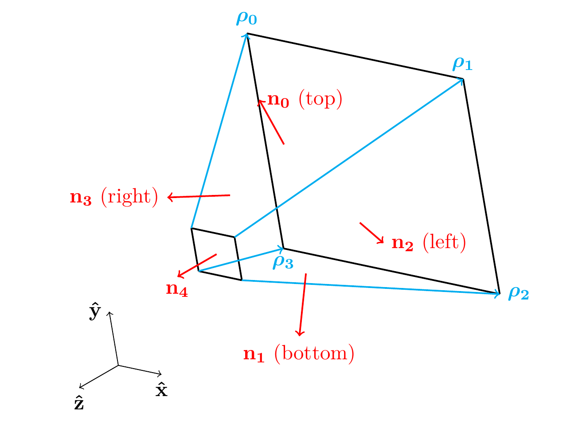
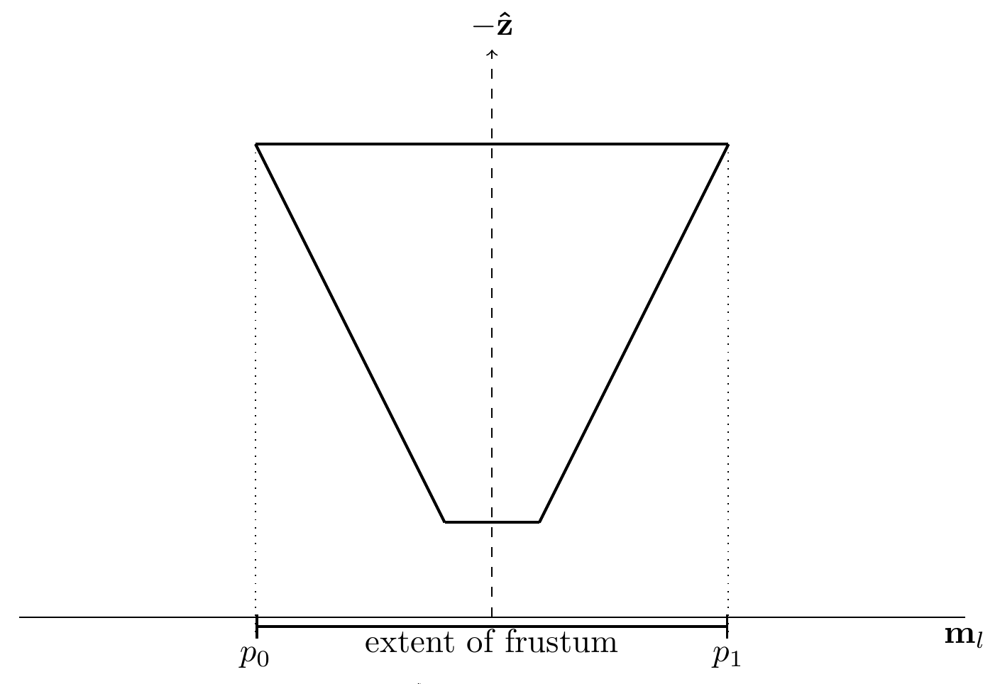
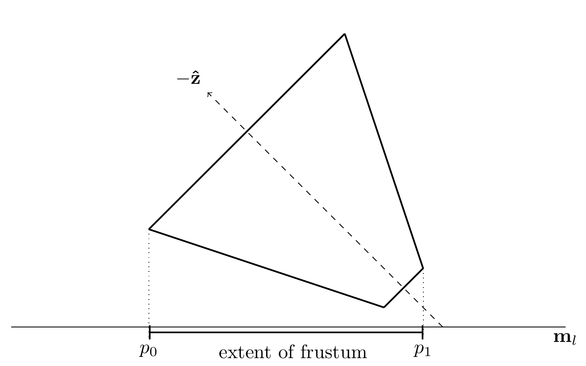

## Introduction

In my [last blog post](/frustum_culling) on frustum culling, I mentioned briefly that it was possible for false negatives to occur when the vertices of an oriented bounding box all lay outside the frustum, despite the two volumes actually intersecting. To be clear, a **false negative** in this case means that the object is flagged as "out of view" and will not be rendered. This results in its absence in our final rendered frame, and in certain conditions it might flicker in and out of existence as bounding box vertices suddenly overlap. This is a worse outcome than the alternative of a **false positive**, where we submit an object for rendering despite it being out of view, as a false positive has no effect on the final frame's appearance, only the amount of time it takes to produce it. In this post, we'll introduce a new culling method that produces no false negatives (or false positives) and explain how we can produce an SIMD optimized implementation using [Intel's ISPC](https://ispc.github.io/).

The most obvious failure case of the previous vertex-based test is when the near plane of the frustum is inside the bounding box itself while the bounding box is large enough that its vertices lie outside the frustum. This case is conceptually easy to test for: simply check whether any of the view frustum origin lies inside the OBB. However, we'd probably want to perform this test in view space, which means we'll need to transform our OBB vertices twice.

A more problematic failure case is when only the edges of our two volumes meet, and the vertices of both volumes lie completely beyond the other object's volume. This case is just as likely to arise, especially if your scene includes objects that are particularly elongated, or in the case of "edge-on-edge" intersections. A more robust solution will need to handle both of these cases and many others if we don't want objects flickering in and out of view.



## Separating Axis Theorem

As was pointed out to me on twitter, an alternative is to use the [Separating Axis Theorem](https://en.wikipedia.org/wiki/Hyperplane_separation_theorem). The theorem states that if two convex shapes are not intersecting, then there exists a separating plane which we could place between them, and perpendicular to this plane is the _separating axis_. If we project these volumes onto this separating axis, their extents along the axis will not overlap.



This means that if we can find any axis for which the OBB and view frustum's projected extents do not overlap, then we know that no intersection exists and we can cull the object. However, the tricky bit is that even if finding a single separating axis is sufficient, finding a non-separating axis doesn't tell us anything! Since we cannot perform an exhaustive search of all the possible directions in 3D space, we'll have to decide on a subset of axes to test, such that we can definitively find a separating axis, if one exists. Recall that our ultimate goal is to cull as many meshes as possible before we submit them to our GPU, so we don't want a method that fails to identify non-intersecting meshes.

Luckily for us, others have figured this out and it turns out that we only need to test about twenty-six different directions. These directions come from the following:

- The normals of each face of both volumes
- The cross products between each unique pair of edges from both volumes

So let's break that down. I've included diagrams of our OBB and frustum that we can use to visualize the different axes:




Note that we can ignore directions that are anti-parallel to axes already under consideration, meaning that for the OBB we need only test three of its normal vectors, which will be parallel to its axes $\textbf{a}_i$. For the view frustum, only its near and far planes have anti-parallel normal vectors so we'll need to test five different normals for that volume.

So that's eight different directions so far. Now let's consider the directions of the edges -- for the OBB, these are all parallel to its normals, so we can use its axes again. For the frustum, we'll need to test the frustum's "up" direction, "right" direction, and the four edges running along the length of the frustum. With the frustum contributing six directions and the OBB contributing three, the cross product pairs result in another eighteen tests, bringing the total to twenty-six different axes that we'll need to check before we can confidently rule out intersection.

To define this mathematically, consider an OBB with axes $\bold{a}_i$, half-extents $e_i$ and a frustum with up axis $\bold{\hat u}$, right axis $\bold{\hat r}$, normals ${\bold{n}_{j}}$ and edges $\boldsymbol{\rho}_{k}$, then our 26 different axes will be the following set:

$$
\bold{m}_l = \begin{cases}
  \bold{a}_i \quad &\forall \ i \in [0, 2] & \quad \text{(3 cases)}\\
  \bold{n}_j \quad &\forall \ j \in [0, 4] & \quad \text{(5 cases)}\\
  \bold{a}_i \times \bold{\hat u} \quad &\forall \ i \in [0, 2] & \quad \text{(3 cases)}\\
  \bold{a}_i \times \bold{\hat r} \quad &\forall \ i \in [0, 2] & \quad \text{(3 cases)}\\
  \bold{a}_i \times \boldsymbol{\rho}_k \quad &\forall \ i \in [0, 2], \ k \in [0, 3] & \quad \text{(12 cases)}\\
\end{cases}\\
$$

We can make things much simpler for ourselves by performing these calculation in view space, where our frustum's origin is at $(0, 0, 0)$ and it's up axis $\bold{\hat u}$ and right axis $\bold{\hat r}$ will just be aligned with the $\boldsymbol{\hat x}$ and $\boldsymbol{\hat y}$ axes, respectively, making it trivial to calculate our edge vectors $\boldsymbol{\rho}_{k}$ and normal vectors $\bold{n}_{j}$. If our view frustum has near and far planes at $z_{near}$ and $z_{far}$ and the near plane has half-width $x_{near}$ and half-height $y_{near}$ then we can define both the normals and edges as the following:

$$
\begin{array}{cccc}
  \boldsymbol{\rho}_{0} = \ (&-x_{near}, &  y_{near}, & z_{near}&) \\
  \boldsymbol{\rho}_{1} = \ (& x_{near}, &  y_{near}, & z_{near} &) \\
  \boldsymbol{\rho}_{2} = \ (& x_{near}, & -y_{near}, & z_{near} &) \\
  \boldsymbol{\rho}_{3} = \ (&-x_{near}, & -y_{near}, & z_{near}&) \\
\end{array}
$$
$$
\begin{array}{cccc}
  \bold{n}_{0} = \ (& z_{near}, & 0, & -x_{near} &) \\
  \bold{n}_{1} = \ (&-z_{near}, & 0, & -x_{near} &) \\
  \bold{n}_{2} = \ (& 0,  &-z_{near}, & -y_{near} &) \\
  \bold{n}_{3} = \ (& 0,  & z_{near}, & -y_{near} &) \\
  \bold{n}_{4} = \ (& 0,  & 0, & 1 &) \\
\end{array}
$$

The last question we have to solve is how to project our volumes onto the axis. For the OBB, it is fairly straightforward. We can project the center of the OBB onto the axis and then work out it's extent along the axis from that center; let's define that interval as $[d-r,d+r]$ where $d$ is the projected center of the OBB and $r$ is the projected radius. We can calculate these two terms using:

$$
d= \bold{c} \cdot \bold{m}_l\\
r = \sum_{i=0}^{2} e_i |\bold{m}_l \cdot \bold{a}_i |
$$

Where $\bold{c}$ is the center of the OBB, $\bold{a}_i$ is the ith axis of the OBB, and $e_i$ is the scalar extent of the OBB along the ith axis.

Projecting our frustum onto the axis is a bit more complicated. In theory, we'd need to project each of the frustum's vertices onto the axis and select the minimum and maximum values to find the extent. But really, we can save ourselves a bit of work by reasoning about when the near plane will be "further out" along the axis than the far plane. Consider the diagram below:



Here the axis is perpendicular with the direction of the view frustum $\mathbf{-\hat z}$, so we know that the extent will be defined by the vertices at the far plane of the frustum. But as the separating axis is rotated away from the view direction, we might see something like the following:



Here, the lower bound of the projection, $p_0$, is still defined by a far plane vertex, but the upper bound $p_1$ is defined by a vertex on the near plane. So we can say that as the axis $\mathbf{m}_l$ sweeps across relative to $\mathbf{-\hat z}$, we'll need to consider either the projection of the near plane or the far plane, and we'll have to do this for both bounds. [This document by David Eberly](https://www.geometrictools.com/Documentation/IntersectionBox3Frustum3.pdf) lays out the exact function for calculating $p_0$ and $p_1$, reproduced here using our symbols and restricting the problem to taking place in view space:

$$
\begin{aligned}
  \tau &= x_{near} |\mathbf{m} \cdot \mathbf{\hat x}| + y_{near} |\mathbf{m} \cdot \mathbf{\hat y}| \\

  p_0 &= \begin{cases}
    n(\mathbf{m} \cdot \mathbf{\hat z}) - \tau             \quad & n(\mathbf{m} \cdot \mathbf{\hat z}) - \tau \geq 0 \\
    \frac{f}{n} (\mathbf{m} \cdot \mathbf{\hat z}) - \tau  \quad & n(\mathbf{m} \cdot \mathbf{\hat z}) - \tau \lt 0
  \end{cases}

  \\

  p_1 &= \begin{cases}
    n(\mathbf{m} \cdot \mathbf{\hat z}) + \tau            \quad & n(\mathbf{m} \cdot \mathbf{\hat z}) + \tau \leq 0 \\
    \frac{f}{n} (\mathbf{m} \cdot \mathbf{\hat z}) + \tau \quad & n(\mathbf{m} \cdot \mathbf{\hat z}) + \tau \gt 0
  \end{cases}

\end{aligned}
$$

## Implementation

Now that we are armed with all the mathematical background required, let's implement this in code. First we'll transform our AABB from model into view space, calculating its axes and extents. I took a shortcut here where I just transform 4 adjacent vertices of the AABB which is sufficient to calculate the OBB details only if the transform is affine, but I'm pretty sure your model->view transform is going to be affine 99.9% of the time (if not, please let me know!)

```cpp
struct CullingFrustum
{
    float near_right;
    float near_top;
    float near_plane;
    float far_plane;
};

struct AABB
{
    // Two different corners of the AABB bounding box
    vec3 min;
    vec3 max;
};

struct OBB
{
    vec3 center = {};
    vec3 extents = {};
    // Orthonormal basis
    vec3 axes[3] = {};
};

bool SAT_visibility_test(const CullingFrustum& frustum, const mat4& vs_transform, const AABB& aabb)
{
    // Near, far
    float z_near = frustum.near_plane;
    float z_far = frustum.far_plane;
    // half width, half height
    float x_near = frustum.near_right;
    float y_near = frustum.near_top;

    // Consider four adjacent corners of the ABB
    vec3 corners[] = {
                {aabb.min.x, aabb.min.y, aabb.min.z},
                {aabb.max.x, aabb.min.y, aabb.min.z},
                {aabb.min.x, aabb.max.y, aabb.min.z},
                {aabb.min.x, aabb.min.y, aabb.max.z},
    };

    // Transform corners
    // Note: I think this approach is only sufficient if our transform is non-shearing (affine)
    for (size_t corner_idx = 0; corner_idx < ARRAY_SIZE(corners); corner_idx++) {
        corners[corner_idx] = (vs_transform * corners[corner_idx]).xyz;
    }

    // Use transformed corners to calculate center, axes and extents
    OBB obb = {
        .axes = {
            corners[1] - corners[0],
            corners[2] - corners[0],
            corners[3] - corners[0]
        },
    };
    obb.center = corners[0] + 0.5f * (obb.axes[0] + obb.axes[1] + obb.axes[2]);
    obb.extents = vec3{ length(obb.axes[0]), length(obb.axes[1]), length(obb.axes[2]) };
    obb.axes[0] = obb.axes[0] / obb.extents.x;
    obb.axes[1] = obb.axes[1] / obb.extents.y;
    obb.axes[2] = obb.axes[2] / obb.extents.z;
    obb.extents *= 0.5f;
```

We don't need to transform the frustum at all, since we're performing the calculations in view space.

Now we can start testing, one by one, each of the 26 different potential separating axes, starting with the normals of our frustums. Since we can exit early as soon as we find a single separating axis, we want to first test the axes that are most likely to provide us with a negative. In my tests, the overwhelming majority (~99.9% in my uniform grid) of objects were culled using the frustum and OBB normals, which makes sense since any objects fully behind or beyond our frustum will be culled by $\bold{n}_{4}$, the same applies with the top, bottom, left and right planes.

```cpp
{
    vec3 M = { 0.0f, 0.0f, 1.0f };
    float MoX = 0.0f; // | m . x |
    float MoY = 0.0f; // | m . y |
    float MoZ = M.z; // m . z (not abs!)

    // Projected center of our OBB
    float MoC = obb.center.z;
    // Projected size of OBB
    float radius = 0.0f;
    for (size_t i = 0; i < 3; i++) {
        // dot(M, axes[i]) == axes[i].z;
        radius += fabsf(obb.axes[i].z) * obb.extents[i];
    }
    float obb_min = MoC - radius;
    float obb_max = MoC + radius;
    // We can skip calculating the projection here, it's known
    float m0 = z_far; // Since the frustum's direction is negative z, far is smaller than near
    float m1 = z_near;

    if (obb_min > m1 || obb_max < m0) {
        return false;
    }
}

{
    // Frustum normals
    const vec3 M[] = {
        { 0.0, -z_near, y_near }, // Top plane
        { 0.0, z_near, y_near }, // Bottom plane
        { -z_near, 0.0f, x_near }, // Right plane
        { z_near, 0.0f, x_near }, // Left Plane
    };
    for (size_t m = 0; m < ARRAY_SIZE(M); m++) {
        float MoX = fabsf(M[m].x);
        float MoY = fabsf(M[m].y);
        float MoZ = M[m].z;
        float MoC = dot(M[m], obb.center);

        float obb_radius = 0.0f;
        for (size_t i = 0; i < 3; i++) {
            obb_radius += fabsf(dot(M[m], obb.axes[i])) * obb.extents[i];
        }
        float obb_min = MoC - obb_radius;
        float obb_max = MoC + obb_radius;

        float p = x_near * MoX + y_near * MoY;

        float tau_0 = z_near * MoZ - p;
        float tau_1 = z_near * MoZ + p;

        if (tau_0 < 0.0f) {
            tau_0 *= z_far / z_near;
        }
        if (tau_1 > 0.0f) {
            tau_1 *= z_far / z_near;
        }

        if (obb_min > tau_1 || obb_max < tau_0) {
            return false;
        }
    }
}
```

The approach for the other tests is basically identical. In some cases, such as when testing the OBB axes, you can take short cuts and skip certain dot products, etc. It's up to you if this is worth the trade off of more code, but this seems like "write once" code. [Here's a link to the full function](https://gist.github.com/BruOp/60e862049ac6409d2fd4ec6fa5806b30).

So this is quite a bit more code that what I presented last week, so let's take a look at how it performs. We'll test this the same way as last time, running our test with 10,000 different objects, with their ABBs defined in model space which we'll transform into view space:

```cpp
void cull_obbs_sac(const PerspectiveCamera& camera, const Array<mat4>& transforms, const Array<AABB>& aabb_list, Array<u32>& out_visible_list)
{
    float tan_fov = tan(0.5f * camera.vertical_fov);
    CullingFrustum frustum = {
        .near_right = camera.aspect_ratio * camera.near_plane * tan_fov,
        .near_top = camera.near_plane * tan_fov,
        .near_plane = -camera.near_plane,
        .far_plane = -camera.far_plane,
    };
    for (size_t i = 0; i < aabb_list.size; i++) {
        mat4 transform;
        matrix_mul_sse(camera.view, transforms[i], transform);

        const AABB& aabb = aabb_list[i];
        if (SAT_visibility_test(frustum, transform, aabb)) {
            out_visible_list.push_back(i);
        }
    }
};
```

On my intel i5 6600k, performing this test for all 10,000 objects takes ~0.85ms, which is more than twice as slow as the SSE algorithm presented in the [previous post](/frustum_culling). This isn't great BUT we're also not using SSE just yet (other than calculating the Model->View transform). If we could leverage SSE here to process multiple AABBs at once, then we should expect to see a four times decrease in execution time (ignoring memory bandwidth limitations).

## Parallelism using ISPC

Unlike in my last post, I won't try to write out this function using SSE intrinsics by hand, and instead we'll use Intel's [ISPC](https://ispc.github.io/). ISPC is a separate C-like language that compiles your single program such that it runs in parallel using SIMD intrinsics and registers. It has additional support for splitting the work amongst several cores, but I won't be covering that in this post. You can call the compiled ISPC code directly from C++ using the compiler generated headers, making it fairly easy to integrate into your project once you set up a pre-build step that takes care of calling the ISPC compiler for you. I followed [this guide](https://software.intel.com/content/www/us/en/develop/articles/use-the-intel-spmd-program-compiler-for-cpu-vectorization-in-games.html) on how to do this for MSVC, here's a snipped from my premake script:

```lua

filter "files:**.ispc"
  buildmessage "Compiling ISPC files %{file.relpath}"

  buildoutputs {
    "%{cfg.objdir}/%{file.basename}.obj",
    "%{cfg.objdir}/%{file.basename}_sse4.obj",
    "%{cfg.objdir}/%{file.basename}_avx2.obj",
    "%{file.reldirectory}/%{file.basename}_ispc.h"
  }

  filter { "Debug", "files:**.ispc" }
    buildcommands {
      'ispc -g -O0 "%{file.relpath}" -o "%{cfg.objdir}/%{file.basename}.obj" -h "./%{file.reldirectory}/%{file.basename}_ispc.h" --target=sse4,avx2 --opt=fast-math'
    }

  filter { "Release", "files:**.ispc"}
    buildcommands {
      'ispc -O2 "%{file.relpath}" -o "%{cfg.objdir}/%{file.basename}.obj" -h "./%{file.reldirectory}/%{file.basename}_ispc.h" --target=sse4,avx2 --opt=fast-math'
    }
```

Other than this initial setup, I was was surprised by how trivial it was to convert the code in my `SAT_visibility_test` function to ISPC. I won't go over the specifics of the language here as I think their examples do a pretty good job of that, but I will highlight the potential pitfalls in porting code, namely that the performance that you'll get is going to depend heavily on the memory layout of the passed data. ISPC needs to load data into SIMD registers in order to operate on it in parallel, so if your data structures require anything other than a trivial load to get the data into these registers, expect to take a performance hit.

To explain, let's write out a simple ISPC program that multiplies two lists of vectors:

```cpp
struct vec4 {
  float x;
  float y;
  float z;
  float w;
}

export void vector_multiplication(
  uniform vec4 a_list[],
  uniform vec4 b_list[],
  uniform vec4 out_list[],
  uniform uint32 num_vecs
) {
    foreach(i = 0 ... num_vecs)
    {
        vec4 a = a_list[i];
        vec4 b = b_list[i];

        out_list[i].x = a.x * b.x;
        out_list[i].y = a.y * b.y;
        out_list[i].z = a.z * b.z;
        out_list[i].w = a.w * b.w;
    }
}
```

However, just like if we wanted to "SIMDify" this code ourselves, we'd need to make sure that for each multiply we used registers filled with all the `x` components, all the `y` components, etc. ISPC works the same way and it'll opaquely load the `vec4` data into a struct that looks more like:

```cpp
// SIMD_WIDTH = 256 bytes / 4 bytes;
struct vec4_SoA {
  float x[8];
  float y[8];
  float z[8];
  float w[8];
};
```

But that means that if we pass our ISPC code an `Array<vec4>`, it's going to first have to load 8 different `vec4` elements from the array, and then scatter their individual elements of `x, y, z, w` into an instance of `vec4_SoA` such that it can perform the SIMD multiplies.

Similarly, when it goes the store the data into `out_list[i]`, it'll have to scatter the data from the SIMD registers into the AoS `Array<vec4>` after each operation. We'll end up with _something like_ the following:

```cpp
struct vec4 {
  float x;
  float y;
  float z;
  float w;
}

struct vec4_SoA {
  float x[8];
  float y[8];
  float z[8];
  float w[8];
};

export void vector_multiplication(
  uniform vec4 a_list[],
  uniform vec4 b_list[],
  uniform vec4 out_list[],
  uniform uint32 num_vecs
) {
    for (i = 0; i < num_vecs; i += 8) {
    {
        vec4_SoA a, b;
        for (j = 0; j < 8; ++j) {
            a[j].x = a_list[i + j].x;
            a[j].y = a_list[i + j].y;
            a[j].z = a_list[i + j].z;
            a[j].w = a_list[i + j].w;

            b[j].x = b_list[i + j].x;
            b[j].y = b_list[i + j].y;
            b[j].z = b_list[i + j].z;
            b[j].w = b_list[i + j].w;
        }

        vec4_SoA out;
        out.x = simd_mul(a.x, b.x);
        out.y = simd_mul(a.y, b.y);
        out.z = simd_mul(a.z, b.z);
        out.w = simd_mul(a.w, b.w);

        for (j = 0; j < 8; ++j) {
            out_list[i + j].x = out.x[j];
            out_list[i + j].y = out.y[j];
            out_list[i + j].z = out.z[j];
            out_list[i + j].w = out.w[j];
        }
    }
}
```

Note that this is not ISPC generated code, it's just meant to demonstrate how the data will need to be loaded and written to in this example. The main take away is that if we're not careful, we can end up spending most of our time just performing ["gathers" and "scatters"](https://ispc.github.io/perfguide.html#understanding-gather-and-scatter) on our input data rather than actual calculations. The problem gets worse once you start dealing with larger structs like 4x4 matrices, for instance, as the memory accesses become less coherent. One great feature of the ISPC compiler is that it will warn you when such operations are required, helpful for giving you a lead on potential fixes.

If my explanation isn't clicking for you, I strongly suggest writing some ISPC code with the debugger enabled and stepping through it. You'll be able to see exactly how the data is laid out and how ISPC is actually operating across these arrays rather than the single elements your code implies. [This guide](https://software.intel.com/content/www/us/en/develop/articles/simd-made-easy-with-intel-ispc.html) also has some good diagrams that might help you visualize it as well.

In my case, I initially calculated the Model->View transformation matrix inside ISPC code and it tanked performance due to all the memory gathers and scatters required to load the individual elements of the matrices into our SIMD registers. My ISPC version was about 0.1ms _slower_ than my linear version! One solution would have been to ensure that the transform matrices used an SoA structure, but that would've had implications for my entire program so instead I opted to calculate the transform outside of the ISPC function, calling my hand-rolled SIMD version of matrix-matrix multiplication before passing the transforms to the ISPC function. There's still a single gather required to use that transformed matrix inside the ISPC code, but it's not necessarily possible to avoid any gather operations. In my case, performance ended up being "good enough" after other changes that I did not feel the need to try to keep my matrices in SoA format.

On the other hand, I _did_ transform my AABB data to use SoA, so instead of:

```cpp
struct AABB
{
    // Two different corners of the AABB bounding box
    vec3 min;
    vec3 max;
};

// Using Array<AABB> abbs ...
```

We'll lay out each component of min and max into separate arrays:

```cpp
struct AABB_SoA
{
    Array<float> min_x;
    Array<float> min_y;
    Array<float> min_z;
    Array<float> max_x;
    Array<float> max_y;
    Array<float> max_z;
};
```

This lets ISPC load the AABB data into SIMD registers with a single read. Since I'm not currently using my AABB code for anything else, this was an easy change for me. Again, without this change you'd spend extra trime gathering the AABB data into SIMD registers.

Aside from these changes the [ISPC implementation]((https://gist.github.com/BruOp/9c1500e3b059a515df63c366900ede3b)) is almost identical to the C++ code, but performance is greatly improved: with the same intel i5 6600k, the culling function took **~0.3ms** for 10,000 objects. This is equivalent to the code I presented in the last post, which is still a net win since we're culling much more reliably. I was worried initially that all the various branches would hurt [control coherency](https://ispc.github.io/ispc.html#control-flow-within-a-gang), but as I mentioned, out of our 10,000 objects 99.9% of them are either culled by the first test against the frustum normals or end up needing to test every axis because they are are not culled. So there's very little divergence in my specific test case -- not sure how that will bear out with actual scenes. Here's an actual breakdown of the _maximum_ count of the culled objects from each set of tests over the course of several seconds of moving through my 10,00 object grid while moving around the camera:

| Test set                                | Number of objects culled |
| --------------------------------------- | ------------------------ |
| $\bold{n}_j$                            | 8,913                    |
| $\bold{a}_i$                            | 2                        |
| $\bold{a}_i \times \bold{\hat u}$       | 1                        |
| $\bold{a}_i \times \bold{\hat r}$       | 1                        |
| $\bold{a}_i \times \boldsymbol{\rho}_k$ | 0                        |

Another potential optimization I was prepared to test is to actually assign a "cost" to our different objects and only perform all of the tests for "heavy" meshes that we really don't want running through our GPU unless it's truly in view. However, I worry that just performing all 26 tests is cheap enough that the complexity and potential increase in lane divergence wouldn't make such a change necessary at all. For what it's worth, when I profiled my linear code it turned out that transforming my four corners of my AABB was by far the most expensive part of function call.

So to recap, using the separating axis theorem will not produce false negatives, unlike the previous method. Our ISPC implementation of the method is arguably more readable as it is free of hand-rolled intrinsics, and with some (slightly invasive) changes we made it just as fast as the previous method at 0.3ms for 10,000 objects. I'm still kind of floored by how fast computers are once you start tearing through linear arrays. Thanks again to [Nikita Lisitsa](https://twitter.com/lisyarus) and others for pointing out this better solution to culling. As always, please reach out if you spot anything incorrect!
