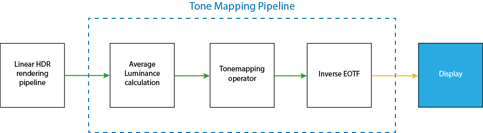
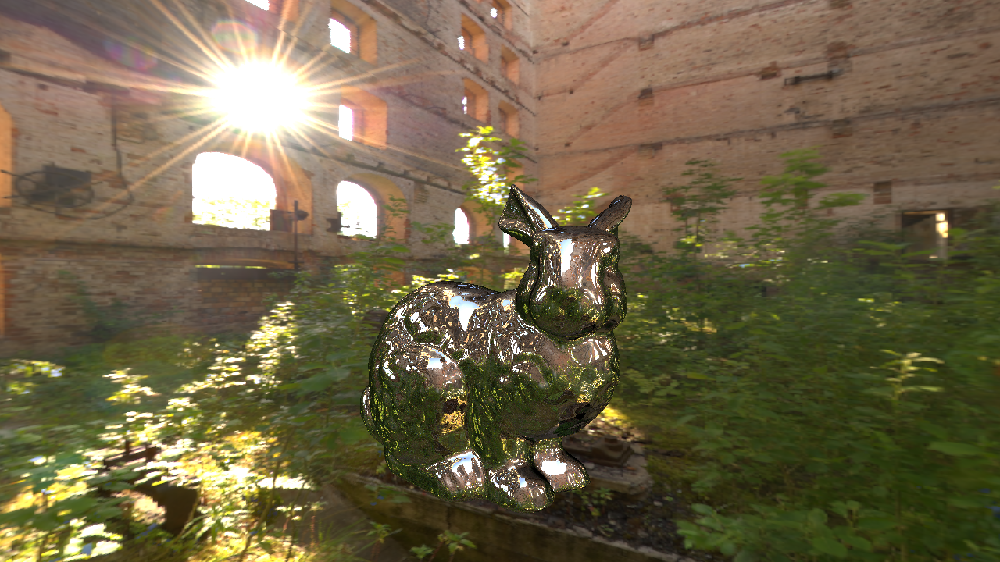
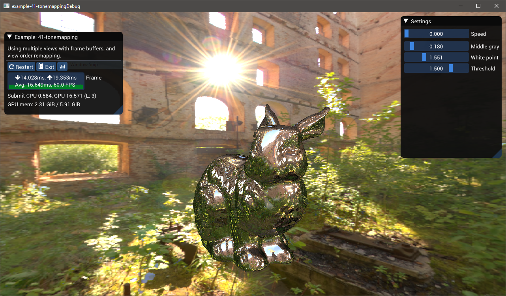
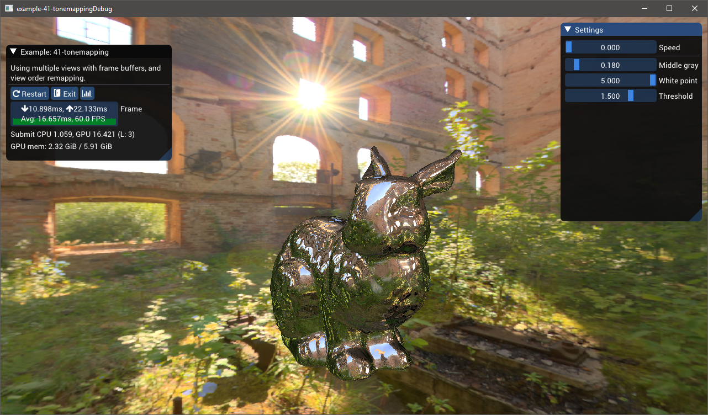
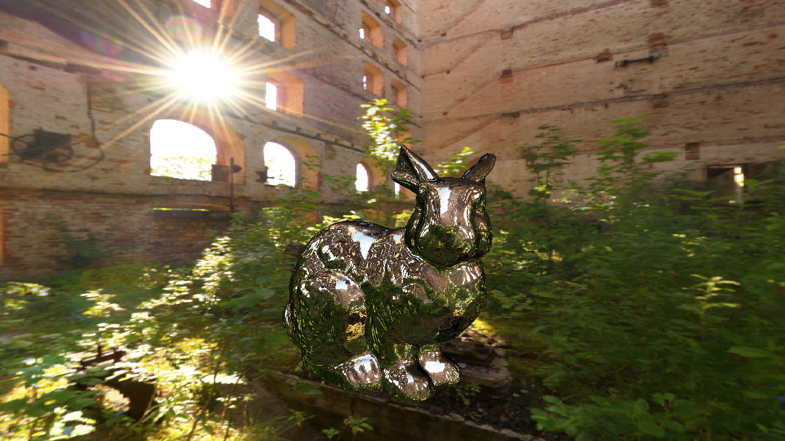
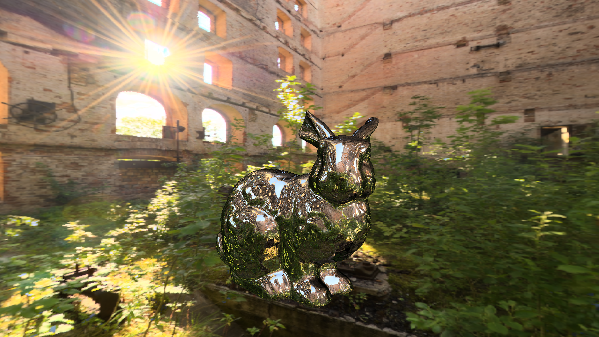
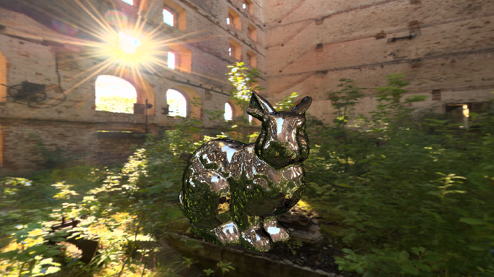
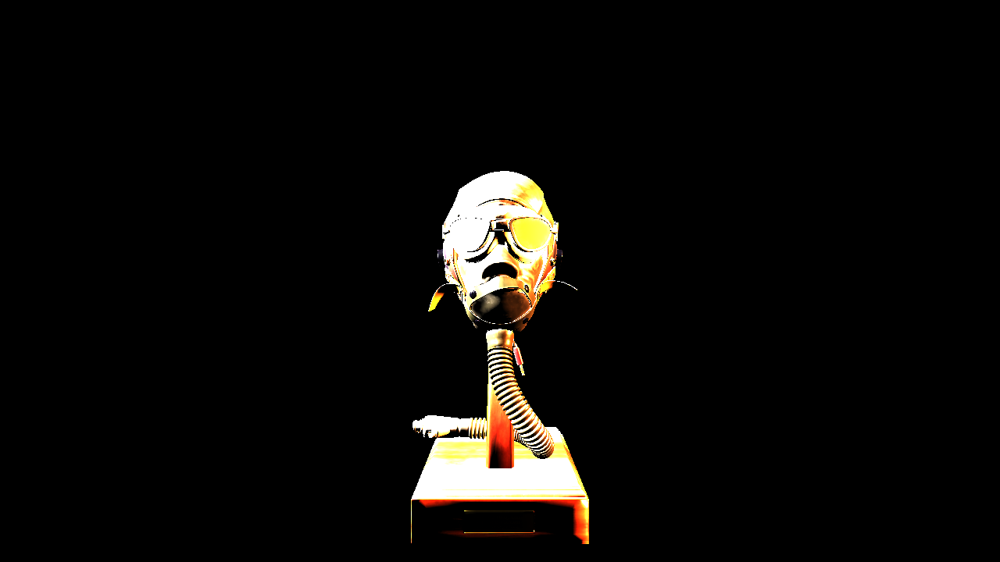
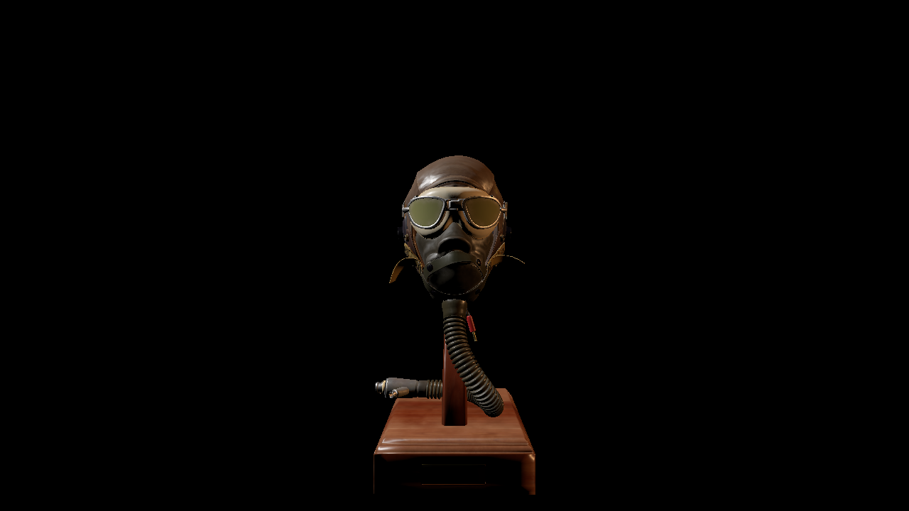

## Introduction

In [the last post](/exposure), I explained how to can calculate the exposure of an HDR image, like the ones produced by in physically based rendering. This exposure allows us to basically "calibrate" our image such that we scale the luminance values to a range where we can now apply a tone curve. In case you didn't read the post, here's the diagram explaining the workflow:



This post will focus on the third box, Tone mapping operators. A tone mapping operator is a curve/function that takes a luminance value (or an individual color channel) as input and spits out a value between [0, 1], which is what our display expects. Additionally, it is meant to produce an image that better invokes the reality. This is totally subjective, and there is no strictly correct choices here since on an Standard Dynamic Range (SDR) display we _cannot actually reproduce the reality_, so we have to settle for creating one that provides roughly the same impression on the viewer. There are simply too many limitations present to achieve perfect reproduction (and it's not even clear that we'd want that), but we can do a much better job than the naive approach of clamping!

There are [many different curves](https://www.shadertoy.com/view/WdjSW3) that fulfill this function, but most have the following features:

- A "shoulder" which is meant to map larger luminance values to values approaching 1, but this convergence is typically asymptotic.
- A "foot", which is mean to control how the lower ranges of luminance are displayed. The foot is not as common or necessary as the shoulder, but it can help prevent darker portions of the image from being too dark.
- A linear or mostly linear portion, controls how your "mid tones" scale.

The simplest example are probably the [Reinhard curves](http://www.cs.utah.edu/~reinhard/cdrom/tonemap.pdf) (Equations 3, 4).

## Reinhard Curves

There are basically two Reinhard curves that people have used over the years. The first, simpler one is as follows:

$$
L_d = \frac{L^\prime}{1+L^\prime}
$$

Where $L_d$ is the final display luminance, and $L^\prime$ is the [exposure adjusted input luminance](/exposure):

$$
L^\prime = \frac{L_{\text{in}}}{9.6 * L_{\text{avg}}}
$$

This is a really easy way to effectively prevent any luminance from exceeding the max value of 1.0, while scaling lower luminance values (where $L << 1$) linearly (e.g $L_d = L$). However, this is going to prevent you from ever actually having a luminance value of 1.0, so there is a second, modified equation that allows us a bit more control over higher luminance values:

$$
L_d = \frac{L^\prime * \left( 1 + \frac{L^\prime}{L_\text{white}^{2}} \right)}{1+L^\prime}
$$

Where $L_{\text{white}}$ is a user-controlled variable that allows us to set the saturation point. You can see how changing $L_{\text{white}}$ changes the function using [this desmos graph](https://www.desmos.com/calculator/h8lpdqtlxi).

To apply these tone operators to our image, we can write a simple fragment shader that takes our HDR PBR output, the average luminosity (store in a 1x1 texture) and writes the output to the backbufffer:

```glsl
$input v_texcoord0

#include "common.sh"

SAMPLER2D(s_texColor, 0);
// This is the output from the compute shaders in the last post
SAMPLER2D(s_texAvgLum, 1);

// This will store whatever params you need for the curve
// (whitePoint in this case)
uniform vec4 u_params;

void main()
{
  vec3 rgb = texture2D(s_texColor, v_texcoord0).rgb;
  float avgLum = texture2D(s_texAvgLum, v_texcoord0).r;

  // Yxy.x is Y, the luminance
  vec3 Yxy = convertRGB2Yxy(rgb);

  float whitePoint   = u_tonemap.y;

  float lp = Yxy.x / (9.6 * avgLum + 0.0001);

  // Replace this line with other tone mapping functions
  // Here we applying the curve to the luminance exclusively
  Yxy.x = reinhard2(lp, whitePoint);

  rgb = convertYxy2RGB(Yxy);

  gl_FragColor = toGamma(vec4(rgb, 1.0) );
}
```

The code is fairly simple, and the process is simple:

1. Transform the RGB value into CIE xyY color space, where the Y is the luminosity
2. Adjust for exposure
3. Scale the luminance (and only the luminance) using the tone curve
4. Perform the reverse transformation (xyY -> RGB)
5. Apply gamma correction and write the results to the backbuffer

For the individual curve codes, `reinhard(Y)` and `reinhard2(Y, whitePoint)`, check this [shader toy](https://www.shadertoy.com/view/WdjSW3).

With Reinhard curves, you don't want to apply the operator to the RGB channels individually, as this will produce highly desaturated blacks. Feel free to try it though and see how output compares.

For reference, here's three images that show the (gamma corrected) results using three different curves: linear (e.g. no operator applied), simple Reinhard and the modified Reinhard:

```grid|3|From left to right: Linear, Simple Reinhard, Modified Reinhard




```

It's worth calling out the problems with the linear example first in order to clarify what we're trying to solve for. Look at the highlights being reflected on the bunny -- they are reflections of the sky above, which is actually a very bright blue. However, the high luminance of the sky causes it to just appear white on the bunny. Similarly, all the windows are blown out and appear uniformly white, while the flare from the sun is enormous. On the other end of the scale, there is actually very little black in the image -- most things that appear black here are actually gray. This means we're not using the entirety of our range from [0, 1] despite there being highly occluded scenery like the area underneath the rabbit, the interior of the foliage, etc. These are some of the more subtle problems we want to solve with our tone mapping.

Meanwhile, the reinhard curves address some, but not all, of these problems. The simple Reinhard really removes white from most of our highlights on the bunny, showing a deep blue sky instead. However, the leaves on the left are now a pale green, which doesn't give the impression that they are actually reflecting a lot of light (which is actually the reality). More noticeably, the sun's flare is now almost completely white, but we can actually see a tiny patch of the sky in the top right of that window, whereas in the linear example, the flare is probably too large but we don't get any unexpected patches of color.

The adjusted reinhard has much better highlights, due to our choice of $L_{\text{white}}$. If our value is too low, then we'll get more and more blown out features like with the linear version, but as $L_{\text{white}}$ grows larger, we'll end up with something very similar to the simple Reinhard. The following three images depict

```grid|3|From left to right: images captured with white points of 1.5, 3.0, and 5.0





```

## Filmic Curves

While Reinhard is clearly better than nothing, the industry has appeared to move towards other curves that are more customizable, especially in terms of how they behave towards the extremes. Romain Guy created an excellent [shader toy](https://www.shadertoy.com/view/WdjSW3) demonstration of these different curves, which I've modified slightly, adding the two reinhard curves.

I decided to try out each of the curves that were used in [Guy's shadertoy](https://www.shadertoy.com/view/WdjSW3), which include:

- The [ACES](https://en.wikipedia.org/wiki/Academy_Color_Encoding_System) curve, with implementation from [Narkowicz](https://knarkowicz.wordpress.com/2016/01/06/aces-filmic-tone-mapping-curve/)
- The tone curve from Unreal Engine, based off the ACES curve. Couldn't find too many details on this implementation, but its very close to the ACES curve.
- The [Gran Turismo curve](https://www.desmos.com/calculator/gslcdxvipg) by Hajime Uchimura
- Curve presented by [Timothy Lottes](http://32ipi028l5q82yhj72224m8j.wpengine.netdna-cdn.com/wp-content/uploads/2016/03/GdcVdrLottes.pdf)

```grid|2|Clockwise, starting from the top left: the ACES, Unreal, GT, and Lottes.



```

Each of the tone curves will produce a slightly different "look" to the final image, but it should be obvious that the filmic curves produce a vastly different image from the others. The filmic curves produce a less "washed out" image than the Reinhard curves.

I should also note that the choice to apply the curve to the Luminance values exclusively rather than each RGB channel individually is a choice. John Hable [advocates the latter approach](http://filmicworlds.com/blog/filmic-tonemapping-with-piecewise-power-curves/), but this will result in shifts in Hue. [This presentation by the Frostbite team](https://www.ea.com/frostbite/news/high-dynamic-range-color-grading-and-display-in-frostbite) provides an example of hue preserving vs non-hue preserving tone mapping.

I tried out both methods, and I think that John Hable is probably right here. Applying it solely to the luminance produces some weird behaviour, especially around the sun and highlights, but it also clearly shifts the hue of the final image. The following figure shows the difference for three of our previous curves: ACES, Uchimura, and Lottes.

```grid|2|On the left, the curve is applied to only the luminance; on the right it is applied per RGB channel.





```

## A note on Gamma Correction

I won't go into gamma correction in great detail, but it is an _essential part_ of not only tone mapping, but working with color values in computer graphics in general. But in order for our image to appear correctly even after tone mapping, we need to apply a gamma correction because displays do not expect linear values. A big reason for this is because human perception of brightness is _not linear_. If you don't know much about Gamma or what I'm talking about, here's a few great reads:

- [What Every Coder Should Know About Gamma](http://blog.johnnovak.net/2016/09/21/what-every-coder-should-know-about-gamma/) by John Novak
- [Wikipedia Page on Gamma Correction](https://en.wikipedia.org/wiki/Gamma_correction)
- [Gamma Correction in Computer Graphics](https://www.teamten.com/lawrence/graphics/gamma/)

## Conclusion

There were many different curves presented in this post, which one you want to use is an artistic choice. Personally, I like the look of the GT curve the most. But the ACES curve has gained a lot of popularity in the past few years.

Other things to explore in this topic:

- Localized tone mapping. In this post, we've used a single exposure value to map the entire image, but human eyes are a bit more complex than that. [Bart Wronski](https://bartwronski.com/2016/08/29/localized-tonemapping/) has a good post that goes in depth into what limitations you'll encounter with a global tone mapping operator.
- Technically, we are calculating our exposure using scene-referred luminance after we've multiplied it by the albedo of our materials. It would be more technically correct to use the luminance pre-albedo, but that would require an additional framebuffer of just those values, and my understanding is that this technique is largely avoided.
- We applied our exposure after already rendering our scene in linear HDR space, but this means that the HDR buffer must have enough range to handle extreme radiance values. This can be tough with a RGBA16F buffer, as the max value is 65,504. Instead of dealing with the potential of "infinite" radiance being captured in the HDR buffer, [DICE](https://media.contentapi.ea.com/content/dam/eacom/frostbite/files/course-notes-moving-frostbite-to-pbr-v2.pdf) and others "pre-expose" their lights based off the last frames' luminance.
- This post is specifically for rendering to SDR displays. HDR displays use different encodings, and there is no industry standard quite yet, but it means the workflow is slightly different. [Krzysztof Narkowicz](https://knarkowicz.wordpress.com/2016/08/31/hdr-display-first-steps/) has a blog post explaining first steps to supporting HDR along with some additional resources on the subject.

Also, if you read the last post, you may recall that I presented the following image as output from my toy physically based renderer, **without** tone mapping:



Note that this image lacks Gamma correction so it looks especially bad, but most of the damage is done by having the luminance values outside of the acceptable [0, 1] range. It is technically physically correct, but our display doesn't care. Here is the same scene with tone mapping applied using the modified Reinhard curve, plus gamma correction:



Hopefully the stark difference demonstrates the need for tone mapping if you are attempting to implement PBR shading _with actual physical values_ for your lights. Unlike the bunny images above, where we could still make sense of the blown out highlights, here it's just impossible to get a proper image without abandoning physically meaningful lighting.

## Code Sample

The images of the bunny were created using a BGFX-style example that you can find [here](https://github.com/BruOp/bgfx/tree/tonemapping/examples/41-tonemapping). It includes the set up of the scene and GPU resources as well as the shaders that we've already gone over.

## References

While I've tried to diligently link to my references, I also have a general collection of links on tone mapping [here](https://github.com/BruOp/3d_programming_references#tone-mapping).
